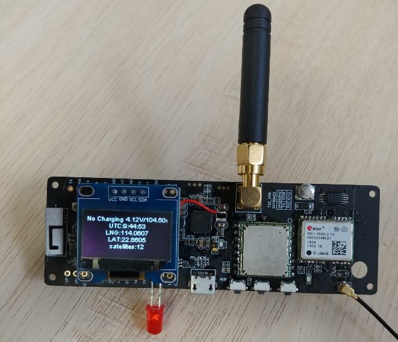

TTGO T22 T-Beam
=====================





## PinOut
| Pins        | T_BEAM_V10 | T_BEAM_V07 |
| ----------- | ---------- | ---------- |
| LORA_SCK    | 5          | 5          |
| LORA_MISO   | 19         | 19         |
| LORA_MOSI   | 27         | 27         |
| LORA_SS     | 18         | 18         |
| LORA_DI0    | 26         | 26         |
| LORA_RST    | 23         | 23         |
| GPS_RX_PIN  | 34         | 12         |
| GPS_TX_PIN  | 12         | 15         |
| I2C_SDA     | 21         | 21         |
| I2C_SCL     | 22         | 22         |
| PMU_IRQ     | 35         | N/A        |
| USER BUTTON | 36         | N/A        |

## Power Control Channel
| Modules | T_BEAM_V10 | T_BEAM_V07 |
| ------- | ---------- | ---------- |
| GPS     | LDO3       | No supoort |
| LORA    | LDO2       | No supoort |


## How to use
- The repository depends on other library files, please recursively clone the repository
    ```
    git clone --recursive https://github.com/Xinyuan-LilyGO/TTGO-T-Beam
    ```

- Then move the library files in the `libraries` directory to
    ```
    C:\Users\<UserName>\Documents\Arduino\libraries
    ```
- In the Arduino board select `T-Beam`
