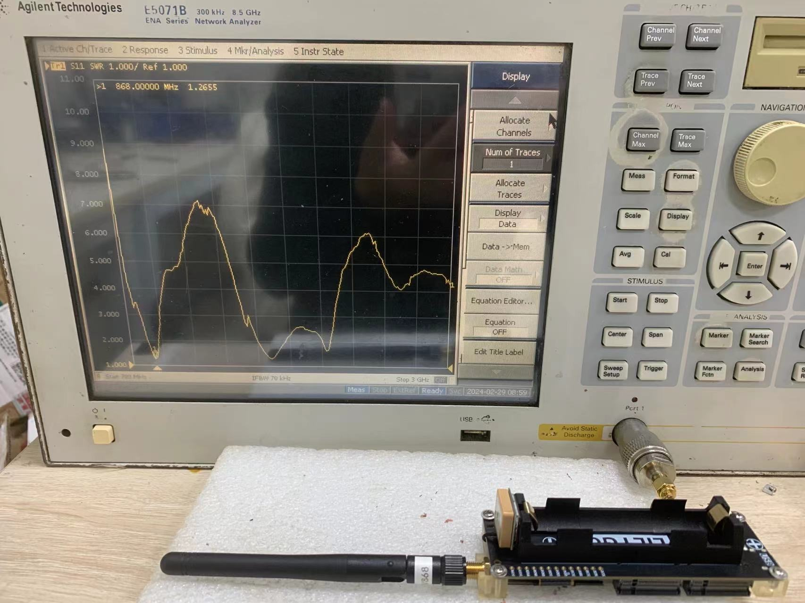
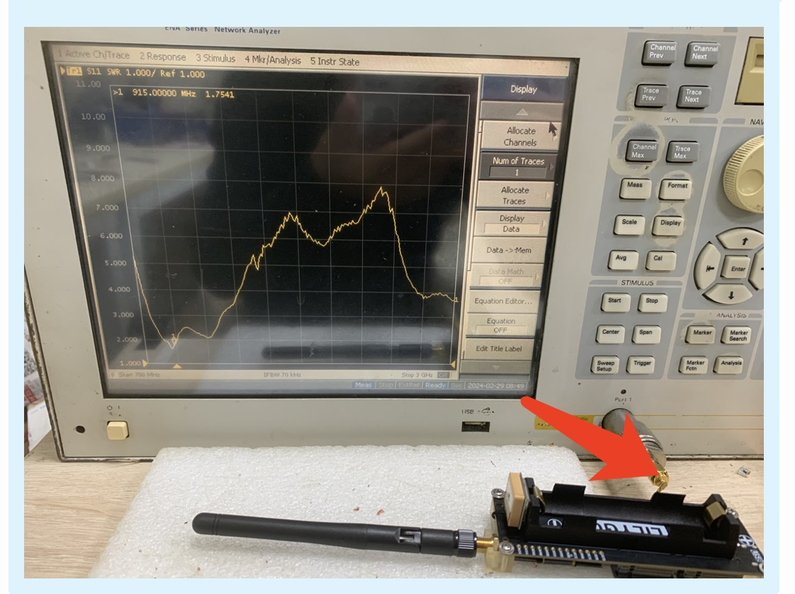

<h1 align = "center">🌟LilyGo LoRa Series🌟</h1>

## **[中文](./README_CN.MD) | English**

## News

- This warehouse currently only maintains the version of LilyGo that is on sale , For the LilyGo discontinued version of the LoRa board, please jump to [Archive package](https://github.com/Xinyuan-LilyGO/LilyGo-LoRa-Series/releases/tag/v0.0.1) to download
- Arduino IDE users need to configure the board to be used in the <utilities.h> file in the sketch directory before using the example. The <utilities.h> file contains the pin definitions of the board. If you do not select it, an error will occur during compilation.

## 1️⃣Product

| Product                            | SOC                    | Flash          | PSRAM          |
| ---------------------------------- | ---------------------- | -------------- | -------------- |
| [T-Beam S3 Supreme L76K][1]        | ESP32-S3FN8            | 8MB(Quad-SPI)  | 8MB(Quad-SPI)  |
| [T-Beam S3 Supreme Ublox][2]       | ESP32-S3FN8            | 8MB(Quad-SPI)  | 8MB(Quad-SPI)  |
| [T-Beam Meshtastic][3]             | ESP32-D0WDQ6-V3        | 4MB(Quad-SPI)  | 8MB(Quad-SPI)  |
| [T-Beam SoftRF][4]                 | ESP32-D0WDQ6-V3        | 4MB(Quad-SPI)  | 8MB(Quad-SPI)  |
| [T3-S3 SX1280 2.4G With out PA][5] | ESP32-S3FH4R2          | 4MB(Quad-SPI)  | 2MB(Quad-SPI)  |
| [T3-S3 SX1280 2.4G With PA][6]     | ESP32-S3FH4R2          | 4MB(Quad-SPI)  | 2MB(Quad-SPI)  |
| [T3-S3 SX1276][7]                  | ESP32-S3FH4R2          | 4MB(Quad-SPI)  | 2MB(Quad-SPI)  |
| [T3-S3 SX1262][8]                  | ESP32-S3FH4R2          | 4MB(Quad-SPI)  | 2MB(Quad-SPI)  |
| [LoRa32 V1.3][8]                   | ESP32-D0WDQ6-V3        | 4MB(Quad-SPI)  | ❌              |
| [LoRa32 V1.6.1][11]                  | ESP32-PICO-D4          | 4MB(Quad-SPI)  | ❌              |
| [T-Motion][9]                      | STM32L073RZ            | 192 Kbyte      | (20-Kbyte RAM) |
| [T-Lora C6][10]                    | ESP32-C6-MINI-1U       | 4MB(Quad-SPI)  | ❌              |
| [T-Beam BPF][12]                   | ESP32-S3-WROOM-1-N16R8 | 16MB(Quad-SPI) | 8MB(OPI)       |
| [T-3 TCXO][13]                     | ESP32-PICO-D4          | 4MB(Quad-SPI)  | ❌              |
| [T-Beam 2W][15]                    | ESP32-S3-WROOM-1-N16R8 | 16MB(Quad-SPI) | 8MB(OPI)       |

[1]: https://www.lilygo.cc/products/softrf-t-beamsupreme?variant=42880905052341 "T-Beam S3 Supreme L76K"
[2]: https://www.lilygo.cc/products/softrf-t-beamsupreme?variant=42880905281717 "T-Beam S3 Supreme Ublox"
[3]: https://www.lilygo.cc/products/t-beam-v1-1-esp32-lora-module "T-Beam Meshtastic"
[4]: https://www.lilygo.cc/products/t-beam-softrf "T-Beam SoftRF"
[5]: https://www.lilygo.cc/products/t3s3-v1-0?variant=42586879656117 "T3-S3 SX1280 2.4G With out PA"
[6]: https://www.lilygo.cc/products/t3s3-v1-0?variant=43043715678389 "T3-S3 SX1280 2.4G With PA"
[7]: https://www.lilygo.cc/products/t3s3-v1-0?variant=42586879688885 "T3-S3 SX1276"
[8]: https://www.lilygo.cc/products/lora-v1-3 "LoRa V1.3"
[9]: https://www.lilygo.cc/products/t-motion-s76g-stm32-lora "T-Motion"
[10]: https://www.lilygo.cc/products/t-lora-c6 "T-Lora C6"
[11]: https://lilygo.cc/products/lora3 "LoRa32 V1.6.1"
[12]: https://www.lilygo.cc/products "T-Beam BPF"
[13]: https://lilygo.cc/products/t3-tcxo "T-3 TCXO"
[15]: https://lilygo.cc/ "T-Beam 2W"


## 2️⃣Example description

```bash
./examples/
├── ArduinoLoRa                              # Only support SX1276/SX1278 radio module
│   ├── LoRaReceiver
│   └── LoRaSender
├── Display                                  # Only supports TBeam TFT Shield
│   ├── Free_Font_Demo
│   ├── TBeam_TFT_Shield
│   ├── TFT_Char_times
│   └── UTFT_demo
├── GPS                                      # T-Beam GPS demo examples
│   ├── TinyGPS_Example
│   ├── TinyGPS_FullExample
│   ├── TinyGPS_KitchenSink
│   ├── UBlox_BasicNMEARead                  # Only support Ublox GNSS Module           
│   ├── UBlox_NMEAParsing                    # Only support Ublox GNSS Module           
│   ├── UBlox_OutputRate                     # Only support Ublox GNSS Module      
│   └── UBlox_Recovery                       # Only support Ublox GNSS Module      
├── LoRaWAN                                  # LoRaWAN examples
│   ├── LMIC_Library_OTTA
│   └── RadioLib_OTAA
├── OLED
│   ├── SH1106FontUsage
│   ├── SH1106GraphicsTest
│   ├── SH1106IconMenu
│   ├── SH1106PrintUTF8
│   ├── SSD1306SimpleDemo
│   └── SSD1306UiDemo
├── PMU                                      # T-Beam & T-Beam S3 PMU demo examples
├── RadioLibExamples                         # RadioLib examples,Support SX1276/78/62/80...
│   ├── Receive_Interrupt
│   └── Transmit_Interrupt
├── Sensor                                   # Sensor examples,only support t-beams3-supreme
│   ├── BME280_AdvancedsettingsExample
│   ├── BME280_TestExample
│   ├── BME280_UnifiedExample
│   ├── PCF8563_AlarmByUnits
│   ├── PCF8563_SimpleTime
│   ├── PCF8563_TimeLib
│   ├── PCF8563_TimeSynchronization
│   ├── QMC6310_CalibrateExample
│   ├── QMC6310_CompassExample
│   ├── QMC6310_GetDataExample
│   ├── QMC6310_GetPolarExample
│   ├── QMI8658_BlockExample
│   ├── QMI8658_GetDataExample
│   ├── QMI8658_InterruptBlockExample
│   ├── QMI8658_InterruptExample
│   ├── QMI8658_LockingMechanismExample
│   ├── QMI8658_MadgwickAHRS
│   ├── QMI8658_PedometerExample
│   ├── QMI8658_ReadFromFifoExample
│   └── QMI8658_WakeOnMotion
|── T3S3Factory                              # T3 S3 factory test examples
└── Factory                                  # T-Beam & T-Beam S3 and BPF factory test examples
```

## 3️⃣Use reference

|    Product    |                        Youtube  link                        |                                                   explanation                                                   | Status |
| :-----------: | :---------------------------------------------------------: | :-------------------------------------------------------------------------------------------------------------: | :----: |
|    T -BEAM    | [Youtube link](https://www.youtube.com/watch?v=Xf1Wf-aTSmc) | How do I drive the T-Beam display  How to use T-Beam for positioning,How to use T-Beams  for communication test |   ✅    |
| LilyGo device | [Youtube link](https://www.youtube.com/watch?v=f3BybP3L7ls) |                                 How to enter boot mode to download the firmware                                 |   ✅    |


## 4️⃣ PlatformIO Quick Start (Recommended)

1. For users using the ESP32 version (non ESP32S3 version), please install the **CH9102 USB bridge** driver for the first time.
   - [Windows](https://www.wch-ic.com/downloads/CH343SER_ZIP.html)
   - [Mac OS](https://www.wch-ic.com/downloads/CH34XSER_MAC_ZIP.html)
2. Install [Visual Studio Code](https://code.visualstudio.com/) and [Python](https://www.python.org/)
3. Search for the `PlatformIO` plugin in the `VisualStudioCode` extension and install it.
4. After the installation is complete, you need to restart `VisualStudioCode`
5. After restarting `VisualStudioCode`, select `File` in the upper left corner of `VisualStudioCode` -> `Open Folder` -> select the `LilyGo-LoRa-Series` directory
6. Wait for the installation of third-party dependent libraries to complete
7. Click on the `platformio.ini` file, and in the `platformio` column
8. Select the board name you want to use in `default_envs` and uncomment it.
9. Uncomment one of the lines `src_dir = xxxx` to make sure only one line works , Please note the example comments, indicating what works and what does not.
10. Click the (✔) symbol in the lower left corner to compile
11. Connect the board to the computer USB-C , Micro-USB is used for module firmware upgrade
12. Click (→) to upload firmware
13. Click (plug symbol) to monitor serial output
14. If it cannot be written, or the USB device keeps flashing, please check the **FAQ** below

## 5️⃣ Arduino IDE quick start

1. Install [Arduino IDE](https://www.arduino.cc/en/software)
2. Install [Arduino ESP32](https://docs.espressif.com/projects/arduino-esp32/en/latest/)
3. Copy all folders in the `lib` directory to the `Sketchbook location` directory. How to find the location of your own libraries, [please see here](https://support.arduino.cc/hc/en-us/articles/4415103213714-Find-sketches-libraries-board-cores-and-other-files-on-your-computer)
     - Windows: `C:\Users\{username}\Documents\Arduino`
     - macOS: `/Users/{username}/Documents/Arduino`
     - Linux: `/home/{username}/Arduino`
4. Open the corresponding example
    - Open the downloaded `LilyGo-LoRa-Series`
    - Open `examples`
    - Select the sample file and open the file ending with `ino`
5. On Arduino ISelect the corresponding board in the DE tool project and click on the corresponding option in the list below to select
     <details>
     <summary>Click to view T-Beam S3 Supreme Arduino IDE options</summary>

     | T-Beam S3 Supreme                    | Value                             |
     | ------------------------------------ | --------------------------------- |
     | Board                                | **ESP32S3 Dev Module**            |
     | Port                                 | Your port                         |
     | USB CDC On Boot                      | Enable                            |
     | CPU Frequency                        | 240MHZ(WiFi)                      |
     | Core Debug Level                     | None                              |
     | USB DFU On Boot                      | Disable                           |
     | Erase All Flash Before Sketch Upload | Disable                           |
     | Events Run On                        | Core1                             |
     | Flash Mode                           | QIO 80MHZ                         |
     | Flash Size                           | **8MB(64Mb)**                     |
     | Arduino Runs On                      | Core1                             |
     | USB Firmware MSC On Boot             | Disable                           |
     | Partition Scheme                     | **8M Flash(3M APP/1.5MB SPIFFS)** |
     | PSRAM                                | **QSPI PSRAM**                    |
     | Upload Mode                          | **UART0/Hardware CDC**            |
     | Upload Speed                         | 921600                            |
     | USB Mode                             | **CDC and JTAG**                  |
     | Programmer                           | **Esptool**                       |

     </details>


     <details>
     <summary>Click to view T-Beam-V1.X Arduino IDE options</summary>

     | T-Beam-V1.X                          | Value                                |
     | ------------------------------------ | ------------------------------------ |
     | Board                                | **ESP32 Dev Module**                 |
     | Port                                 | Your port                            |
     | CPU Frequency                        | 240MHZ(WiFi/BT)                      |
     | Core Debug Level                     | None                                 |
     | Erase All Flash Before Sketch Upload | Disable                              |
     | Events Run On                        | Core1                                |
     | Flash Frequency                      | 80MHZ                                |
     | Flash Mode                           | QIO                                  |
     | Flash Size                           | **4MB(32Mb)**                        |
     | JTAG Adapter                         | Disabled                             |
     | Arduino Runs On                      | Core1                                |
     | Partition Scheme                     | **Huge APP (3MB No OTA/1MB SPIFFS)** |
     | PSRAM                                | **Enable**                           |
     | Upload Speed                         | 921600                               |
     | Programmer                           | **Esptool**                          |

     </details>

     <details>
     <summary>Click to view LoRa32 V1.x or T3 TCXO Arduino IDE options</summary>

     | LoRa32 V1.x  or T3 TCXO              | Value                                |
     | ------------------------------------ | ------------------------------------ |
     | Board                                | **ESP32 Dev Module**                 |
     | Port                                 | Your port                            |
     | CPU Frequency                        | 240MHZ(WiFi/BT)                      |
     | Core Debug Level                     | None                                 |
     | Erase All Flash Before Sketch Upload | Disable                              |
     | Events Run On                        | Core1                                |
     | Flash Frequency                      | 80MHZ                                |
     | Flash Mode                           | QIO                                  |
     | Flash Size                           | **4MB(32Mb)**                        |
     | JTAG Adapter                         | Disabled                             |
     | Arduino Runs On                      | Core1                                |
     | Partition Scheme                     | **Huge APP (3MB No OTA/1MB SPIFFS)** |
     | PSRAM                                | **Disable**                          |
     | Upload Speed                         | 921600                               |
     | Programmer                           | **Esptool**                          |

     </details>

     <details>
     <summary>Click to view T3-S3 V.1x (V1.1~V1.3) Arduino IDE options</summary>

     | T3-S3 V.1x                           | Value                                |
     | ------------------------------------ | ------------------------------------ |
     | Board                                | **ESP32S3 Dev Module**               |
     | Port                                 | Your port                            |
     | USB CDC On Boot                      | Enable                               |
     | CPU Frequency                        | 240MHZ(WiFi)                         |
     | Core Debug Level                     | None                                 |
     | USB DFU On Boot                      | Disable                              |
     | Erase All Flash Before Sketch Upload | Disable                              |
     | Events Run On                        | Core1                                |
     | Flash Mode                           | QIO 80MHZ                            |
     | Flash Size                           | **4MB(32Mb)**                        |
     | Arduino Runs On                      | Core1                                |
     | USB Firmware MSC On Boot             | Disable                              |
     | Partition Scheme                     | **Huge APP (3MB No OTA/1MB SPIFFS)** |
     | PSRAM                                | **QSPI PSRAM**                       |
     | Upload Mode                          | **UART0/Hardware CDC**               |
     | Upload Speed                         | 921600                               |
     | USB Mode                             | **CDC and JTAG**                     |
     | Programmer                           | **Esptool**                          |

     </details>

     <details>
     <summary>Click to view T-Motion Arduino IDE options</summary>

     | T-Motion                    | Value                                    |
     | --------------------------- | ---------------------------------------- |
     | Board                       | **Nucleo-64**                            |
     | Port                        | Your port                                |
     | Debug symbols and core logs | None                                     |
     | Optimize                    | Smallest (-Os default)                   |
     | Board part number           | Nucleo L073RZ                            |
     | C Runtime Library           | Newlib Nano (default)                    |
     | Upload method               | STM32CubeProgrammer (DFU)                |
     | USB support (if available)  | CDC (generic 'Serial' supersede U(S)ART) |
     | U(S)ART support             | Enabled (generic 'Serial')               |
     | USB speed (if available)    | Low/Full Speed                           |

     - To upload a sketch, you need to hold down the BOOT button on the board and then plug in the USB. At this time, it will enter the DFU mode to allow program writing.

     </details>

     <details>
     <summary>Click to view T3-C6 Arduino IDE options</summary>

     | T3-C6                                | Value                                                   |
     | ------------------------------------ | ------------------------------------------------------- |
     | Board                                | **ESP32C6 Dev Module**                                  |
     | Port                                 | Your port                                               |
     | USB CDC On Boot                      | Enable                                                  |
     | CPU Frequency                        | 160MHZ(WiFi)                                            |
     | Core Debug Level                     | None                                                    |
     | USB DFU On Boot                      | Disable                                                 |
     | Erase All Flash Before Sketch Upload | Disable                                                 |
     | Flash Mode                           | DIO                                                     |
     | Flash Size                           | **4MB(32Mb)**                                           |
     | Arduino Runs On                      | Core1                                                   |
     | USB Firmware MSC On Boot             | Disable                                                 |
     | Partition Scheme                     | **Default 4M Flash with spiffs(1.2M APP/1.5MB SPIFFS)** |
     | Upload Speed                         | 921600                                                  |
     | Programmer                           | **Esptool**                                             |

     </details>

     <details>
     <summary>Click to view T-Beam PBF or T-Beam 2W Arduino IDE options</summary>

     | T-Beam PBF                           | Value                               |
     | ------------------------------------ | ----------------------------------- |
     | Board                                | **ESP32S3 Dev Module**              |
     | Port                                 | Your port                           |
     | USB CDC On Boot                      | Enable                              |
     | CPU Frequency                        | 240MHZ(WiFi)                        |
     | Core Debug Level                     | None                                |
     | USB DFU On Boot                      | Disable                             |
     | Erase All Flash Before Sketch Upload | Disable                             |
     | Flash Mode                           | QIO 80Mhz                           |
     | Flash Size                           | **16MB(128Mb)**                     |
     | Arduino Runs On                      | Core1                               |
     | USB Firmware MSC On Boot             | Disable                             |
     | Partition Scheme                     | **16M Flash (3MB APP/9.9MB FATFS)** |
     | PSRAM                                | **OPI PSRAM**                       |
     | Upload Speed                         | 921600                              |
     | Programmer                           | **Esptool**                         |

     - T3-S3 SX1280/PA Version QWIIC GPIO10,GPIO21 Unavailable, already used as SX1280 RX TX antenna switching function

     </details>
6. Please uncomment the `utilities.h` file of each sketch according to your board model, otherwise the compilation will report an error.
7. Upload sketch


## 6️⃣ TTN

To access TTN (The Things Network), please refer to [LilyGo_LoRa_Series_Quick_Start](./docs/zh/LilyGo_LoRa_Series_Quick_Start_On_TTN_zh.md)


## 7️⃣ Application

- [T-Beam SoftRF](https://github.com/lyusupov/SoftRF)
- [T-Beam Paxcounter](https://github.com/cyberman54/ESP32-Paxcounter)
- [T-Beam Meshtastic](https://github.com/meshtastic/Meshtastic-device)

# 8️⃣ Datasheet

##### T-Beam S3 Supreme datasheet

- [T-Beam Supreme schematic](schematic/LilyGo_T-BeamS3Supreme.pdf)
- [AXP2101 datasheet](./lib/XPowersLib/datasheet/AXP2101_Datasheet_V1.0_en.pdf)
- [SX1262 datasheet](https://www.semtech.com/products/wireless-rf/lora-transceivers/sx1262)
- [LR1121 datasheet](https://www.semtech.com/products/wireless-rf/lora-connect/lr1121)
- [GSP MAX-M10 datasheet](https://www.u-blox.com/zh/product/max-m10-series)
- [PCF8563 datasheet](./lib/SensorsLib/datasheet/PCF8563%20Datasheet%20Rev.11.pdf)
- [QMI8658 datasheet](./lib/SensorsLib/datasheet/QMI8658A%20Datasheet%20Rev1.0.pdf)
- [QMC6310 datasheet](./lib/SensorsLib/datasheet/QMC6310%20Datasheet%20Rev.C.pdf)
- [BME280 datasheet](https://www.bosch-sensortec.com/products/environmental-sensors/humidity-sensors-bme280/)
- [Quectel_L76K_GNSS_Protocol_Specification_V1.2](./docs/datasheet/Quectel_L76KL26K_GNSS_协议规范_V1.2.pdf)
- [CASIC_ProtocolSpecification](./docs/datasheet/CASIC_ProtocolSpecification.pdf)


##### T-Beam ESP32 datasheet

- [T-Beam_V1.2 schematic](schematic/LilyGo_TBeam_V1.2.pdf)
- [AXP192 datasheet](http://www.x-powers.com/en.php/Info/product_detail/article_id/29)
- [SX1262 datasheet](https://www.semtech.com/products/wireless-rf/lora-transceivers/sx1262)
- [GSP NEO-6/NEO-8 datasheet](https://www.u-blox.com/en/product/neo-6-series)

##### T3-S3 (ESP32S3) datasheet

- [T3_S3_V1.2 schematic](schematic/T3_S3_V1.2.pdf)
- [T3_S3_V1.3 schematic](schematic/T3_S3_V1.3.pdf)
- [SX1262 datasheet](https://www.semtech.com/products/wireless-rf/lora-transceivers/sx1262)
- [SX1278 datasheet](https://www.semtech.com/products/wireless-rf/lora-transceivers/sx1278)
- [SX1276 datasheet](https://www.semtech.com/products/wireless-rf/lora-transceivers/sx1276)
- [LR1121 datasheet](https://www.semtech.com/products/wireless-rf/lora-connect/lr1121)
- [SX1280 datasheet](https://www.semtech.cn/products/wireless-rf/lora-connect/sx1280)

##### LoRa32(ESP32) datasheet

[T3_V1.6.1 schematic](schematic/T3_V1.6.1.pdf)

##### LoRa32(V1.3) datasheet

[T3_V1.3 schematic](schematic/T3_V1.3.pdf)


##### T-Motion datasheet

[T-Motion schematic](schematic/T-Motion.pdf)

##### T3-C6 datasheet

[T3-C6 schematic](schematic/T3-C6_V1.0.pdf)

##### T3-TCXO datasheet

[T3-TCXO schematic](schematic/T3_V3.0.pdf)

##### T-Beam-2W datasheet

[T-Beam-2W schematic](schematic/T-Beam_2W_V1.0.pdf)


# 9️⃣ FAQ

1. T-Beam Supreme GPS backup power comes from 18650 battery. If you remove the 18650 battery, you will not be able to get GPS hot start. If you need to use GPS hot start, please connect the 18650 battery.
2. There is no data output from the GPS. [Refer to GPS factory reset](firmware/GPS_Reset/README.MD)
3. How to find the pin definition?
     <details>
     <summary>
     Click to view detailed
     </summary>

     - Each sketch contains <utilities.h>, and all board pins are written in this file
  
     </details>

4. Can’t upload sketches?
     <details>
     <summary>
     Click to view detailed
     </summary>

    1. Connect the board USB to the computer
    2. Press the BOOT button and hold (If there is no BOOT button, you need to keep **GPIO0** connected to **GND**.)
    3. Press the RST button
    4. Release the RST button
    5. Finally release the BOOT button(If there is no BOOT button, you need to disconnect GPIO0 from GND.)
    6. Click to upload the program

     </details>
5. After setting the output power of LoRa, you need to set the minimum current. Set up sx1262 as follows:
     <details>
     <summary>
     Click to view detailed
     </summary>

     ```c
     // set output power to 10 dBm (accepted range is -17 - 22 dBm)
     if (radio.setOutputPower(22) == RADIOLIB_ERR_INVALID_OUTPUT_POWER) {
         Serial.println(F("Selected output power is invalid for this module!"));
         while (true);
     }
     // set over current protection limit to 80 mA (accepted range is 45 - 240 mA)
     // NOTE: set value to 0 to disable overcurrent protection
     if (radio.setCurrentLimit(80) == RADIOLIB_ERR_INVALID_CURRENT_LIMIT) {
         Serial.println(F("Selected current limit is invalid for this module!"));
         while (true);
     }
     ```

     </details>
6. Precautions for using SX1280 PA version
     <details>
     <summary>
     Click to view detailed
     </summary>

    - When using the SX1280 PA module, it is recommended that the software controls the 1280 chip to output 2~5dbm, so that the entire module will output 20dbm power;
    When the output of the 1280 chip is higher than 2dbm, the output power of the entire module is only 20dbm;
    When the output of the 1280 chip is higher than 5dbm, the output power of the entire module is only 20dbm, but if 5dbm is given to the FEM, it will damage the FEM chip (the maximum input allowed by the FEM is 5dbm)
    If the output of the 1280 chip is lower than 2dbm, the output power of the entire module is within 20dbm.
    - T3-S3 PA version SX1280 output power setting cannot be greater than 2~5dbm, otherwise the FEM chip may be damaged. Setting 3dbm already has 20dmb output power
  
     </details>
7. How to identify the LoRa model?
     <details>
     <summary>
     Click to view detailed
     </summary>

     - To identify the LoRa model, you only need to check the sticker on the board. 433MHz is SX1278, 868MHz is SX1276, and if the label says SX1262, it is SX1262.

     </details>
8. Why does Serial not have any output?
    - Arduino -> Tools -> USB CDC On Boot -> Enable

9. T-Beam-s3-supreme antenna signal quality
     <details>
     <summary>
     Click to view detailed
     </summary>

     
     

     </details>

10. T3-S3 Qwiic GPIO10, GPIO21 cannot be used?
     <details>
     <summary>
     Click to view detailed
     </summary>

     - If you are using the SX1280/SX1280PA version, these two GPIOs are already connected to the Radio TX/RX Pin and cannot be used.
     - If you are using the SX1262/SX1276 version, you can use GPIO10,21 by removing the two resistors in the figure below. Otherwise, the GPIO is connected to Radio DIO3,DIO4 by default.

     

     </details>