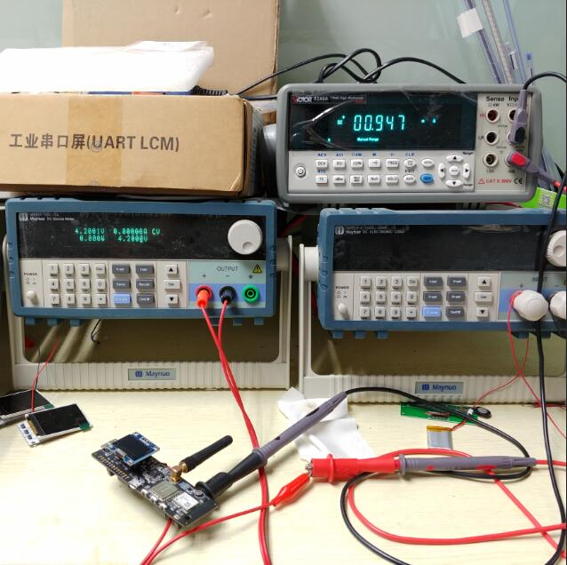

TTGO-T-Beam
=====================

## PinOut
| Pins        | T_BEAM(AXP192) | T_BEAM_V07 |
| ----------- | -------------- | ---------- |
| LORA_SCK    | 5              | 5          |
| LORA_MISO   | 19             | 19         |
| LORA_MOSI   | 27             | 27         |
| LORA_SS     | 18             | 18         |
| LORA_DI0    | 26             | 26         |
| LORA_RST    | 23             | 23         |
| GPS_RX_PIN  | 34             | 12         |
| GPS_TX_PIN  | 12             | 15         |
| I2C_SDA     | 21             | 21         |
| I2C_SCL     | 22             | 22         |
| PMU_IRQ     | 35             | N/A        |
| USER BUTTON | 36             | N/A        |

## Power Control Channel
| Modules | T_BEAM_V10 | T_BEAM_V07 |
| ------- | ---------- | ---------- |
| GPS     | LDO3       | No supoort |
| LORA    | LDO2       | No supoort |
| OLED    | DCDC1      | No supoort |

### Button Map

| USB | BTN1            | BTN2        | BTN3  |
| --- | --------------- | ----------- | ----- |
| N/A | axp192 powerkey | user button | reset |

##  Button Function:
- Click button 2 will cycle the motherboard function, the default start to enable GPS positioning, the second click will be set to lora send, the third click will be set to lora receive, long press for two seconds and then release, will enter deep sleep

## About OLED:
- The boot will scan the I2C device. If the OLED is found, all log information will be displayed in the OLED. If not, it will be printed on the serial port.

## How to use
- For dependencies on other files please see `platformio.ini`
- Regarding the board, you can modify the board version and lora frequency in `board_def.h`
- If you use the Arduino IDE for compilation, please store `board_def.h` and `LilyGO-T-Beam.ino` in the same directory, and the directory folder name must be the same as ino

## Deepsleep
- Regarding deep sleep, except for DCDC3, power off all channels of AXP192, the current consumption is about 0.9mA

