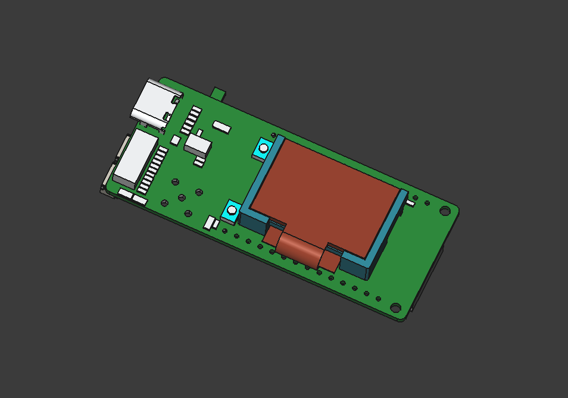
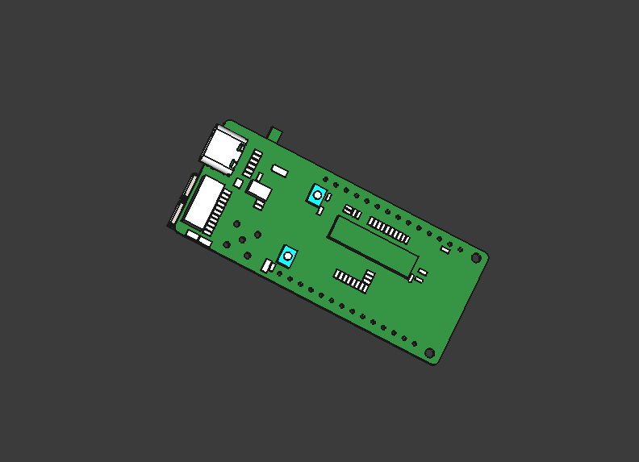
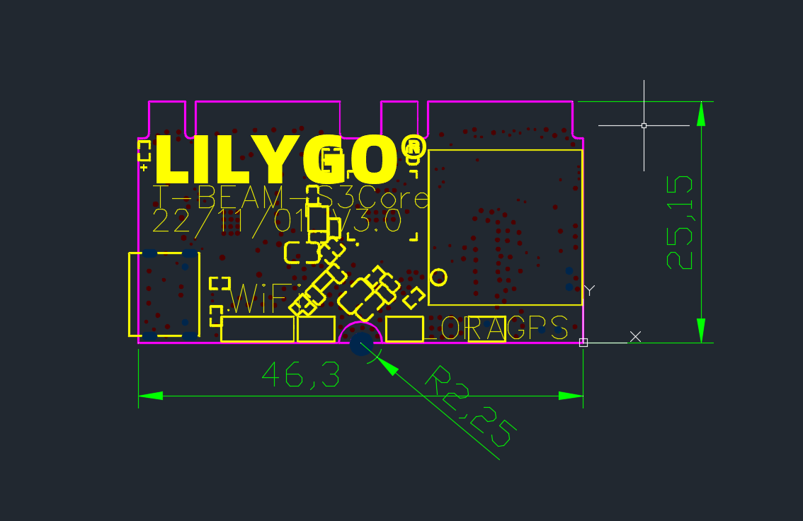
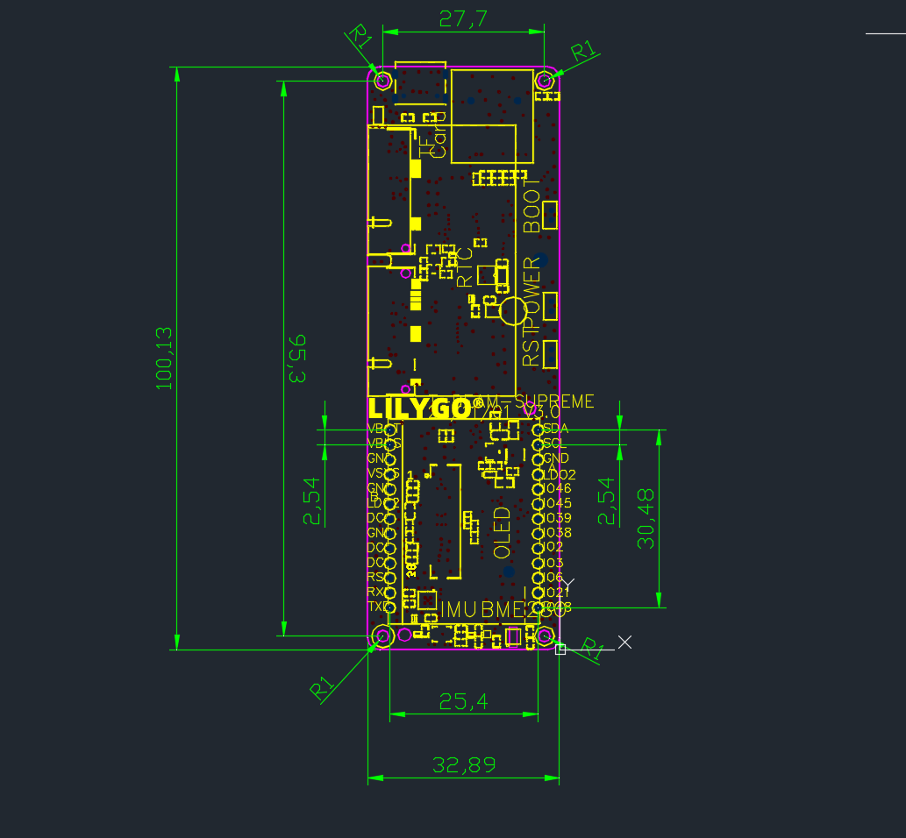

# Shell

| Board                   | Shell                                       |
| ----------------------- | ------------------------------------------- |
| T-Beam-Supreme          | [Shell](./T-Beam-Suppeme.7z)                |
| T-Beam-V1.1/V1.2        | [Shell](./T-Beam-V1X.7z)                    |
| T3-V2.1-1.6             | [Shell](./T3-V2.1-1.6.7z)                   |
| T3-S3 OLED              |               |
| T3-S3                   |                    |
| T-Beam-Supreme-Shell.7z |  |
| T3-V1.6.2               |             |
| T3_V1.6_PCB_3D.7z       |             |
| TT3_V3.0_TCXO           |               |
| T-Beam-S3-Core          |               |
| T-Beam-Supreme          |          |

