# LilyGo LoRa Series Quick Start On The Things Network

**English | [中文](../zh/LilyGo_LoRa_Series_Quick_Start_On_TTN_zh.md)**

## Index

- [Required](#required)
- [Run sx1302_hal on the Raspberry Pi](#run-sx1302_hal-on-the-raspberry-pi)
  - [Deploy sx1302_hal](#deploy-sx1302hal)
  - [Get relevant information](#get-relevant-information)
- [Create a gateway on TTN](#create-a-gateway-on-ttn)
- [Check gateway connection status](#check-gateway-connection-status)
- [Create end device model on TTN](#create-end-device-model-on-ttn)
  - [Enter the create Application page](#enter-the-create-application-page)
  - [Create end device](#create-end-device)
- [LoRaWAN End Device](#lorawan-end-device)
  - [Firmware Compile](#firmware-compile)
  - [Flash Onto The Device](#flash-onto-the-device)
  - [Example Output](#example-output)
- [Q&A](#qa)
  - [LMIC error occurs when building `T-Motion S76G` firmware](#lmic-error-occurs-when-building-t-motion-s76g-firmware)
- [Version History](#version-history)

## Required

> LoRaWAN End Device: T-Motion S76G
>
> LoRaWAN Gateway: Raspberrypi Model 3B + T-SX1302
>
> raspios: [raspios_lite_arm64-2022-01-28](https://downloads.raspberrypi.org/raspios_lite_arm64/images/raspios_lite_arm64-2022-01-28/2022-01-28-raspios-bullseye-arm64-lite.zip)
>
> TTN Version: v3.15.1

## Run sx1302_hal on the Raspberry Pi

> NOTE
>
> The LoRaWAN gateway that has been connected to TTN, you can ignore this section

### Deploy sx1302_hal

Execute [sx1302_hal.sh](../../tools/sx1302_hal.sh) on Raspberry Pi to automatically deploy sx1302_hal.

```shell
sudo ./sx1302_hal.sh -f eu868
sudo reboot
```

### Get relevant information

```shell
pi@raspberrypi:~ $ cat .sx1302_hal/.output
Gateway EUI: B827EBFFFEFC7AF0
Gateway Server address: eu1.cloud.thethings.network
Gateway Server port: 1700
```

## Create a gateway on TTN

1. Log in to https://console.cloud.thethings.network/

2. Select the cluster according to the frequency band supported by the gateway. The frequency band supported by `T-SX1302` is `868MHZ`, here you need to select the `Europe1` cluster

    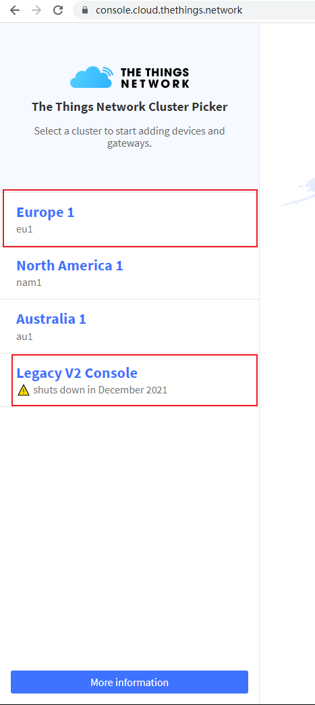

    > ! Warning
    >
    > `Legacy V2 Console` is a server of TTN V2 version, it will be closed in December 2021, it is not recommended to use

3. Create a gateway

    

4. Configure gateway information

    Fill in the [Gateway EUI] obtained after deploying sx1302_hal (#get related information)

    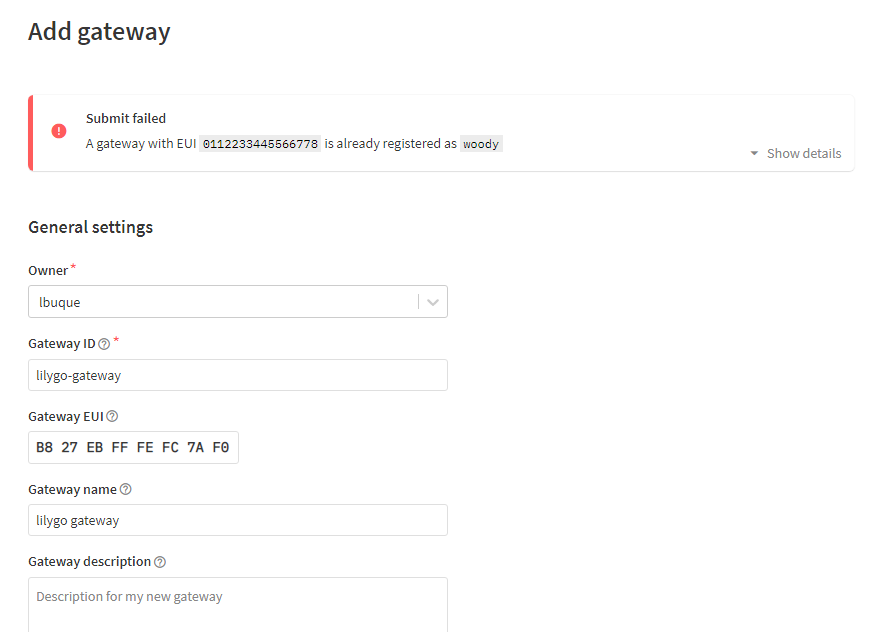

5. Select frequency，Need to be consistent with the frequency band parameters of sx1302_hal.sh

    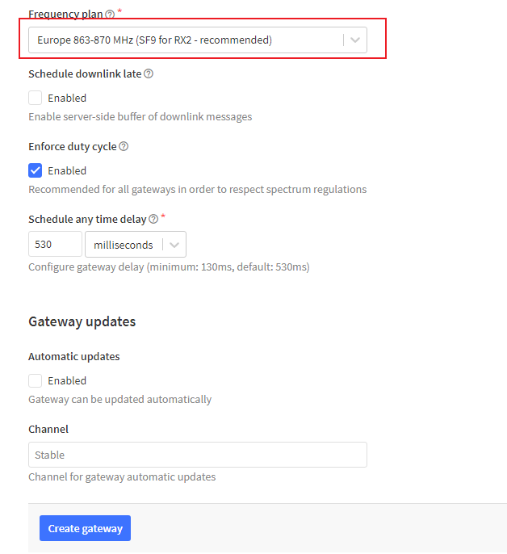

## Check gateway connection status

Check if the gateway is successfully connected on TTN

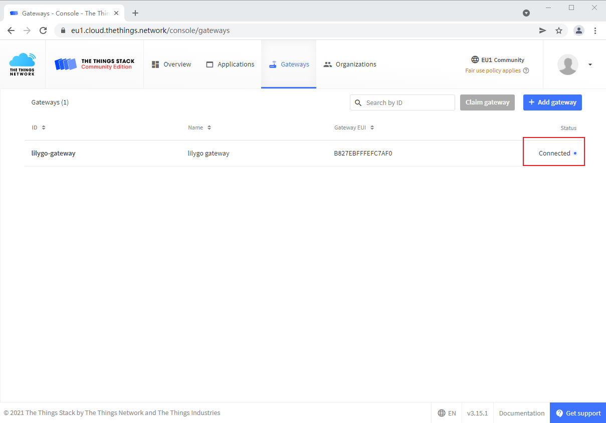

## Create end device model on TTN

### Enter the create Application page

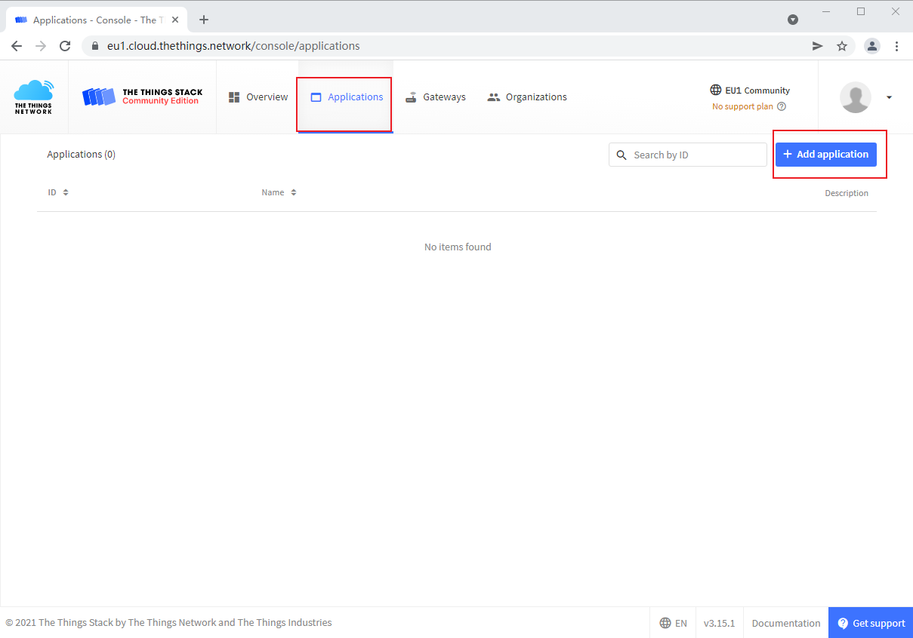

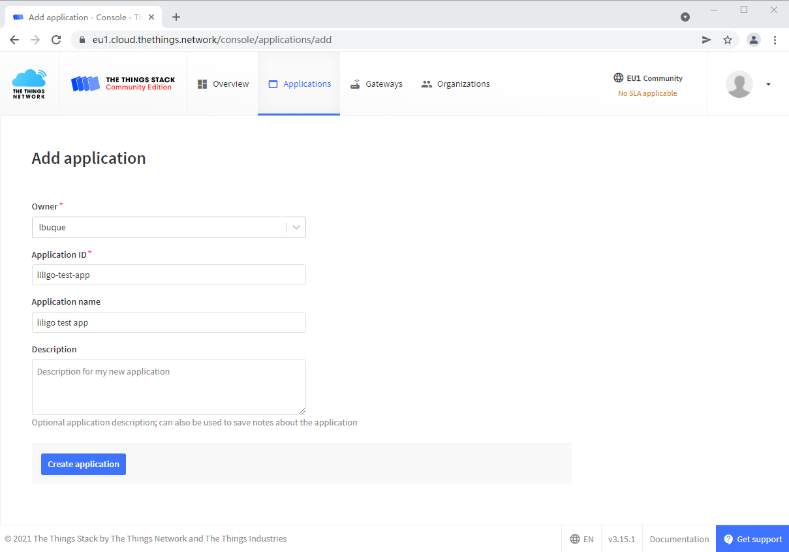

### Create end device

Create a lorawan device, use OTAA to access the network by default

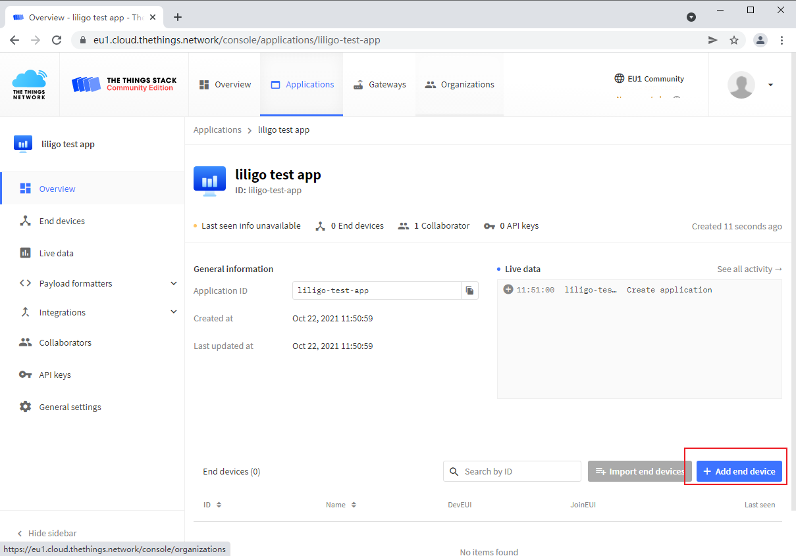

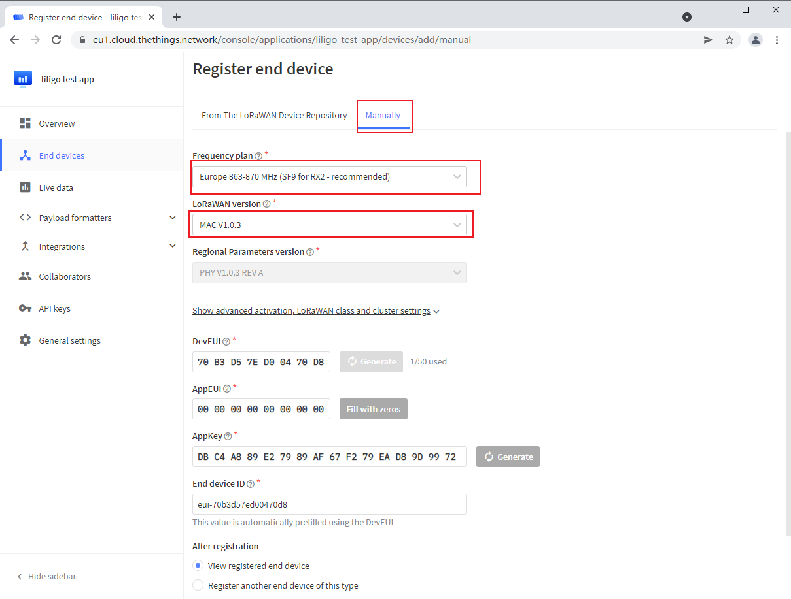

>  NOTE
>
> `DevEUI`, `AppEUI`, `AppKey` can be selected to generate

## LoRaWAN End Device

### Firmware Compile

1. Download Example code

```shell
git clone https://github.com/Xinyuan-LilyGO/LilyGo-LoRa-Series.git
```

2. Create Arduino project

Go to the `LilyGo-LoRa-Series\examples\TTN\TTN_OTTA` directory and modify the `TTN_OTTA.cpp` file to `TTN_OTTA.ino`

Open `TTN_OTTA.ino` and configure the project as follows:

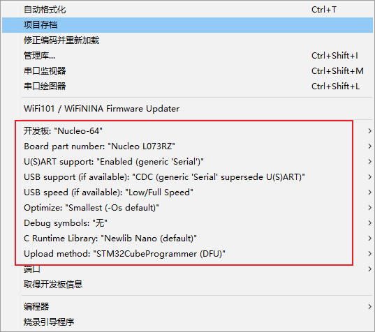

3. Modify board information

Make the following changes to `utilities.h·`:

```diff
diff --git a/examples/TTN/TTN_OTTA/utilities.h b/examples/TTN/TTN_OTTA/utilities.h
index 2874773..9b8aade 100644
--- a/examples/TTN/TTN_OTTA/utilities.h
+++ b/examples/TTN/TTN_OTTA/utilities.h
@@ -7,7 +7,7 @@
 // #define LILYGO_T3_V1_0
 // #define LILYGO_T3_V1_6
 // #define LILYGO_T3_V2_0
-// #define LILYGO_T_MOTION_S76G
+#define LILYGO_T_MOTION_S76G

 // #define LILYGO_T_MOTION_S78G         //Not support
 /*
@@ -171,12 +171,3 @@
 #else
 #error "For the first use, please define the board version and model in <utilities. h>"
 #endif
```

4. Modify LoRaWAN network access information

Fill the `DevEUI`, `AppEUI`, `AppKey` generated on TTN into the `loramac.cpp` file according to the corresponding byte order:

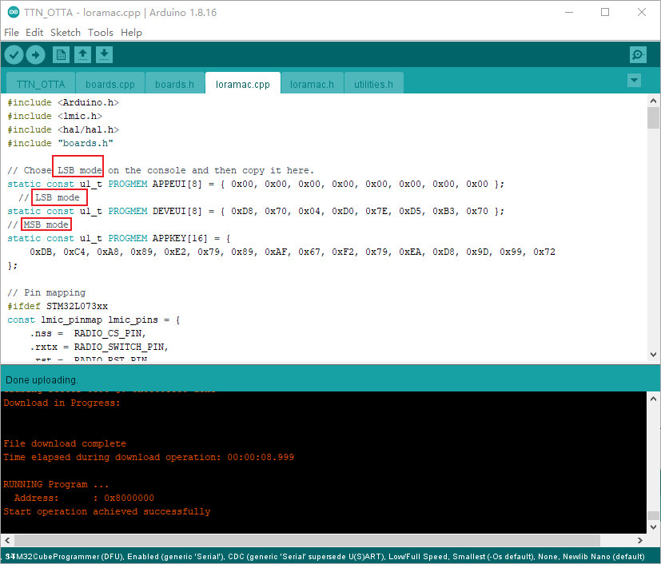


Compiled successfully:

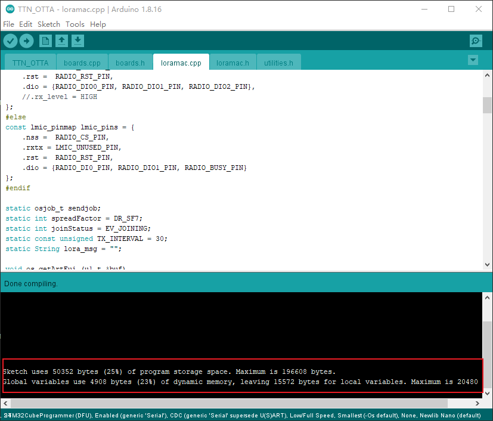

### Flash Onto The Device

1. Insert `T-Motion S76G` into the USB port of the PC

2. Press and hold the `BOOT` button, then press the `RESET` button, and click the `upload` button in the Arduino IDE

3. The firmware is successfully burned as follows

   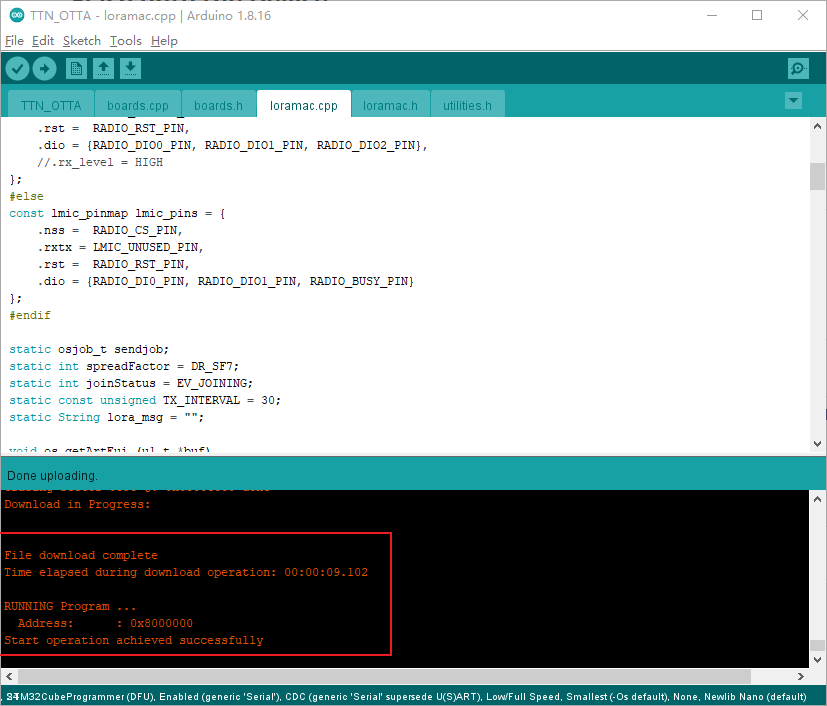

4. Reconnect `T-Motion S76G` to the USB port of the PC

### Example Output

Use the serial port debugging tool, select the `DTR` check box, plug the `T-Motion S76G` into the USB interface of the PC and quickly open the serial port, you can see the debugging information output

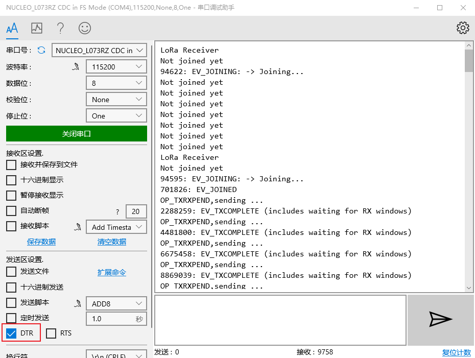

On TTN, you can see that the data in the `MAC payload` field is consistent with the data sent in `loramac.cpp`

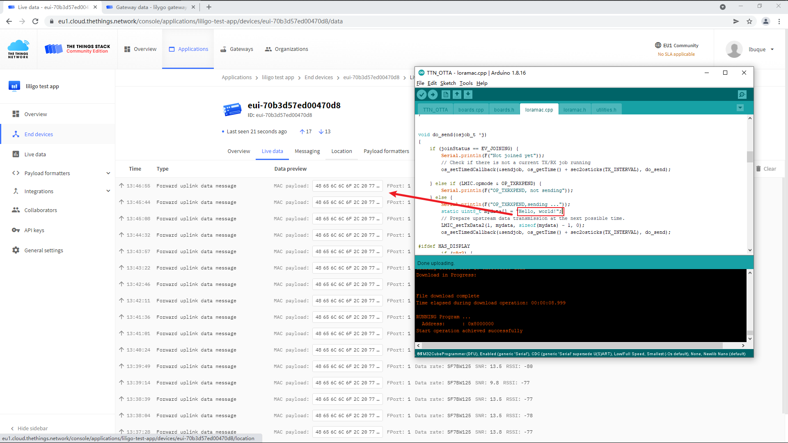

## Q&A

### LMIC error occurs when building `T-Motion S76G` firmware

The following problems occur because of the incompatibility of the LMIC library version:

```log
loramac.cpp:25:1: error: 'const lmic_pinmap' has no non-static data member named 'rx_level'
   25 | };
      | ^
exit status 1
'const lmic_pinmap' has no non-static data member named 'rx_level'
```

Make the following modifications to the `loramac.cpp` file:

```diff
diff --git a/examples/TTN/TTN_OTTA/loramac.cpp b/examples/TTN/TTN_OTTA/loramac.cpp
index 896be89..6b39f54 100644
--- a/examples/TTN/TTN_OTTA/loramac.cpp
+++ b/examples/TTN/TTN_OTTA/loramac.cpp
@@ -21,7 +21,7 @@ const lmic_pinmap lmic_pins = {
     .rxtx = RADIO_SWITCH_PIN,
     .rst =  RADIO_RST_PIN,
     .dio = {RADIO_DIO0_PIN, RADIO_DIO1_PIN, RADIO_DIO2_PIN},
-    .rx_level = HIGH
+    //.rx_level = HIGH
 };
 #else
 const lmic_pinmap lmic_pins = {
@@ -217,5 +217,3 @@ void loopLMIC(void)
 {
     os_runloop_once();
 }
```

## Version History

| Version | Major changes   | Date       | Author  |
| ------- | --------------- | ---------- | ------- |
| 1.0.0   | Initial release | 2021/10/22 | liangyy |
