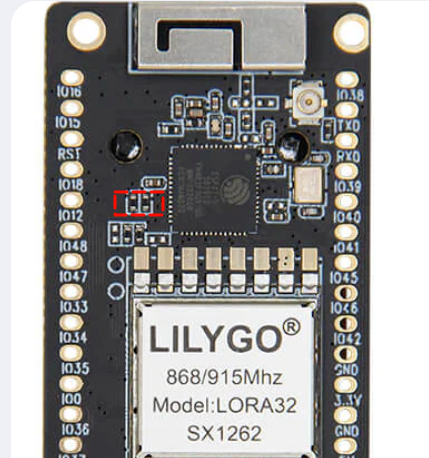
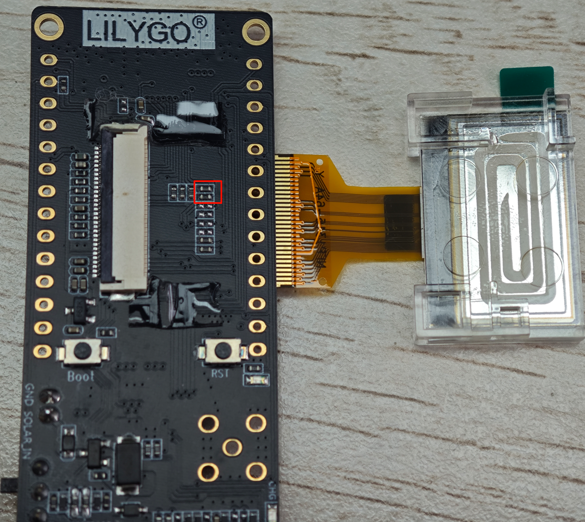
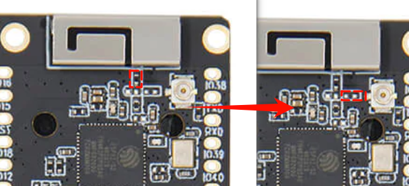
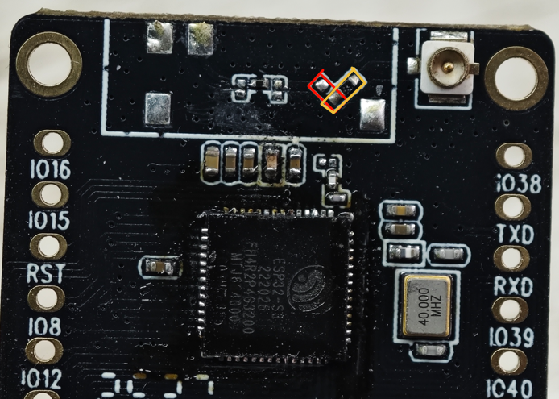
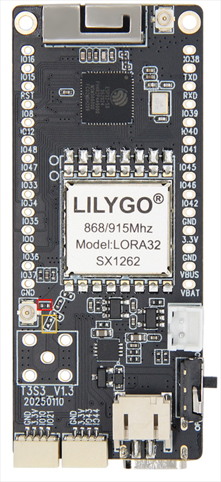
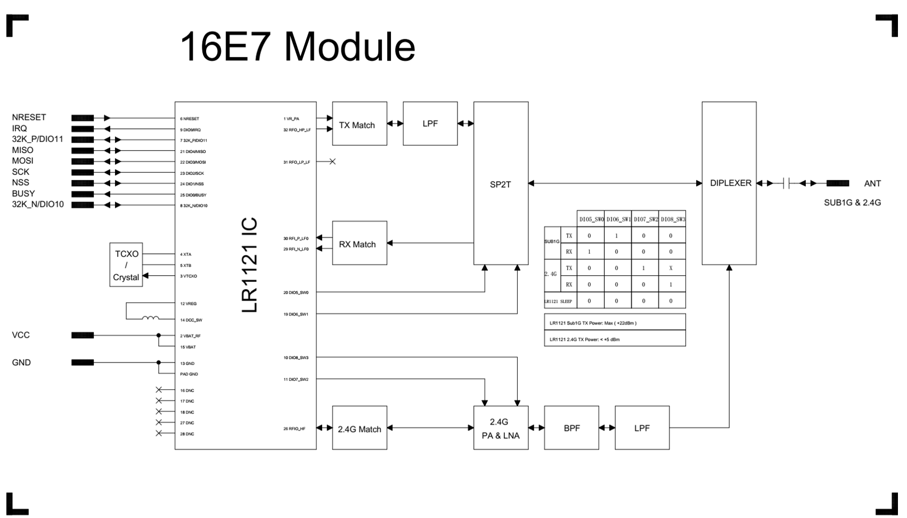

  

<h1 align = "center">🌟LilyGo T3 S3 LR1121 PA Version🌟</h1>

## Overview

* This page introduces the hardware parameters related to `LilyGo T3 S3 LR1121 PA Version`

### Notes on use

1. This version does not have BMS, please use a lithium-ion battery with battery protection function
2. Please be sure to connect the antenna before transmitting, otherwise it is easy to damage the RF module
3. The T3-S3 V1.2 and T3-S3 V1.3 use the same pins; the only difference is the charging circuit.

### Product

| Product    | SOC           | Flash         | PSRAM         |
| ---------- | ------------- | ------------- | ------------- |
| [T3-S3][1] | ESP32-S3FH4R2 | 4MB(Quad-SPI) | 2MB(Quad-SPI) |

[1]: https://www.lilygo.cc/products/t3s3-v1-0?variant=42586879688885 "T3-S3"

## PlatformIO Quick Start

1. Install [Visual Studio Code](https://code.visualstudio.com/) and [Python](https://www.python.org/)
2. Search for the `PlatformIO` plugin in the `Visual Studio Code` extension and install it.
3. After the installation is complete, you need to restart `Visual Studio Code`
4. After restarting `Visual Studio Code`, select `File` in the upper left corner of `Visual Studio Code` -> `Open Folder` -> select the `LilyGo-LoRa-Series` directory
5. Wait for the installation of third-party dependent libraries to complete
6. Click on the `platformio.ini` file, and in the `platformio` column
7. Select the board name you want to use in `default_envs` and uncomment it.
8. Uncomment one of the lines `src_dir = xxxx` to make sure only one line works , Please note the example comments, indicating what works and what does not.
9. Click the (✔) symbol in the lower left corner to compile
10. Connect the board to the computer USB-C , Micro-USB is used for module firmware upgrade
11. Click (→) to upload firmware
12. Click (plug symbol) to monitor serial output
13. If it cannot be written, or the USB device keeps flashing, please check the **FAQ** below

## Arduino IDE quick start

1. Install [Arduino IDE](https://www.arduino.cc/en/software)
2. Install [Arduino ESP32](https://docs.espressif.com/projects/arduino-esp32/en/latest/)
3. Copy all folders in the `lib` directory to the `Sketchbook location` directory. How to find the location of your own libraries, [please see here](https://support.arduino.cc/hc/en-us/articles/4415103213714-Find-sketches-libraries-board-cores-and-other-files-on-your-computer)
    * Windows: `C:\Users\{username}\Documents\Arduino`
    * macOS: `/Users/{username}/Documents/Arduino`
    * Linux: `/home/{username}/Arduino`
4. Open the corresponding example
    * Open the downloaded `LilyGo-LoRa-Series`
    * Open `examples`
    * Select the sample file and open the file ending with `ino`
5. On Arduino Select the corresponding board in the IDE tool project and click on the corresponding option in the list below to select

    | Name                                 | Value                                                |
    | ------------------------------------ | ---------------------------------------------------- |
    | Board                                | **ESP32S3 Dev Module**                               |
    | Port                                 | Your port                                            |
    | USB CDC On Boot                      | Enable                                               |
    | CPU Frequency                        | 240MHZ(WiFi)                                         |
    | Core Debug Level                     | None                                                 |
    | USB DFU On Boot                      | Disable                                              |
    | Erase All Flash Before Sketch Upload | Disable                                              |
    | Flash Mode                           | QIO 80Mhz                                            |
    | Flash Size                           | **4MB(32Mb)**                                        |
    | Arduino Runs On                      | Core1                                                |
    | USB Firmware MSC On Boot             | Disable                                              |
    | Partition Scheme                     | **Default 4MB with spiffs (1.2MB APP/1.5MB SPIFFS)** |
    | PSRAM                                | **OPI PSRAM**                                        |
    | Upload Speed                         | 921600                                               |
    | Programmer                           | **Esptool**                                          |

6. Please uncomment the `utilities.h` file of each sketch according to your board model e.g `T3_S3_V1_2_LR1121_PA`, otherwise the compilation will report an error.
7. Upload sketch

### 📍 Pins Map

| Name                   | GPIO NUM                  | Free |
| ---------------------- | ------------------------- | ---- |
| (QWIIC) Uart1 TX       | 43(External QWIIC Socket) | ✅️    |
| (QWIIC) Uart1 RX       | 44(External QWIIC Socket) | ✅️    |
| QWIIC Socket IO10*     | 10(External QWIIC Socket) | ✅️    |
| QWIIC Socket IO21*     | 21(External QWIIC Socket) | ✅️    |
| SDA                    | 18                        | ❌    |
| SCL                    | 17                        | ❌    |
| OLED(**SSD1306**) SDA  | Share with I2C bus        | ❌    |
| OLED(**SSD1306**) SCL  | Share with I2C bus        | ❌    |
| SD CS                  | 13                        | ❌    |
| SD MOSI                | 11                        | ❌    |
| SD MISO                | 2                         | ❌    |
| SD SCK                 | 14                        | ❌    |
| LoRa(**LR1121**) SCK   | 5                         | ❌    |
| LoRa(**LR1121**) MISO  | 3                         | ❌    |
| LoRa(**LR1121**) MOSI  | 6                         | ❌    |
| LoRa(**LR1121**) RESET | 8                         | ❌    |
| LoRa(**LR1121**) DIO9  | 36                        | ❌    |
| LoRa(**LR1121**) BUSY  | 34                        | ❌    |
| LoRa(**LR1121**) CS    | 7                         | ❌    |
| Button1 (BOOT)         | 0                         | ❌    |
| Battery ADC            | 1                         | ❌    |
| On Board LED           | 37                        | ❌    |

* You can use GPIO10,21 by removing the two resistors in the figure below. Otherwise, the GPIO is connected to DIO8,DIO7 of Radio by default.
* SDA(18) and SCL(17) are not brought out and cannot be accessed. They can only be used as other GPIOs through QWIIC or header pins. During initialization, use explicit initialization `Wire.begin(sda,scl);` Any unused GPIO can be used as SDA and SCL.

| T3 V1.2                                          | T3 V1.3                                          |
| ------------------------------------------------ | ------------------------------------------------ |
|  |  |

### 🧑🏼‍🔧 I2C Devices Address

| Devices              | 7-Bit Address | Share Bus |
| -------------------- | ------------- | --------- |
| OLED Display SSD1306 | 0x3C          | ✅️         |

### ⚡ Electrical parameters

| Features                           | Details  |
| ---------------------------------- | -------- |
| 🔗USB-C Input Voltage               | 5V       |
| 🔗Solar Input Voltage(T3 V1.3 Only) | 4.5~5.6V |
| ⚡Charge Current                    | 500mA    |
| 🔋Battery Voltage                   | 3.7V     |
| 🔋Battery Socket Cables             | PH2.0mm  |
| 🔗QWIIC Socket Cables               | JST1.0   |
| VBUS Pin                           | 5V       |
| VBAT Pin                           | 4.2V     |

> \[!IMPORTANT]
>
> T3 V1.3 The maximum solar input voltage can only be 5.6V. If the voltage exceeds this, the Zener diode will discharge and cause the diode to heat up.T3 V1.3 
>
> VBUS pin and USB-C port share the same circuit. Please ensure that you do not connect different voltages to the USB-C and VBUS pins, and that power is supplied from only one point.
>
> VBAT pin and battery connector are on the same circuit. Please ensure that you do not connect different voltages to the battery connector and VBAT pin, and ensure that power is supplied from only one point.
> 
> If you need to use an external BMS to power the motherboard, the best approach is to connect it via the VBAT port. Note that the voltage connected should be the external BMS's battery voltage (maximum 4.2V). Because the onboard charging management cannot be disconnected, please ensure that the USB-C port is not connected simultaneously while the external BMS is charging; otherwise, both the onboard charging management and the external BMS will charge the battery at the same time.

### Button Description

| Channel | Peripherals                    |
| ------- | ------------------------------ |
| BOOT    | Boot mode button, customizable |
| RST     | Reset button                   |

### LED Description

* CHG LED

| LED State | Details               |
| --------- | --------------------- |
| On        | Battery charging      |
| Off       | Battery Full          |
| Blink     | Battery not connected |

* User LED

1. The LED is connected to ESP32 GPIO37, and the LED is turned on or off by writing a high or low level

### RF parameters

| Features                  | Details                            |
| ------------------------- | ---------------------------------- |
| RF  Module                | LR1121                             |
| Frequency range           | 400-520MHz/830-945MHz/2400-2500MHz |
| Transfer rate(LoRa Sub1G) | 0.018 K ～ 62.5 Kbps               |
| Transfer rate(FSK Sub1G)  | 0.6 K ～ 300 Kbps                  |
| Transfer rate(LoRa 2.4G)  | 0.476 K~101.5 Kbps                 |
| Modulation                | LoRa,FSK,LR-HFSS                   |

> \[!IMPORTANT]
>
> ⚠️⚠️⚠️
> LR1121 version with a built-in PA, do not set the maximum power above 0dBm.
> This is because a power amplifier is added to the RF front end; setting it to 0dBm will achieve an output power of 22dBm.
> Setting it above 1dBm may damage the PA.
>

### LoRa Antenna Switch Truth Table

| Freq    | Mode  | DIO5_SW0 | DIO6_SW1 | DIO7_SW2 | DIO8_SW3 |
| ------- | ----- | -------- | -------- | -------- | -------- |
| 868/915 | TX    | 0        | 1        | 0        | 0        |
| 868/915 | RX    | 1        | 0        | 0        | 0        |
| 2.4G    | TX    | 0        | 0        | 1        | 0        |
| 2.4G    | RX    | 0        | 0        | 0        | 1        |
| SLEEP   | SLEEP | 0        | 0        | 0        | 0        |

## WiFi-IPEX

* The following figure shows how to switch the onboard WIFI antenna to IPEX

| T3 V1.2                                        | T3 V1.3                                        |
| ---------------------------------------------- | ---------------------------------------------- |
|  |  |

## LoRa-IPEX

* The following figure shows how to switch the onboard LoRa SMA antenna to IPEX

### LR1121 RF Block Diagram

#### Resource

* [T3_S3_V1.2 schematic](../../../schematic/T3_S3_V1.2.pdf)
* [T3_S3_V1.3 schematic](../../../schematic/T3_S3_V1.3.pdf)
* [LR1121 datasheet](https://www.semtech.com/products/wireless-rf/lora-connect/lr1121)
