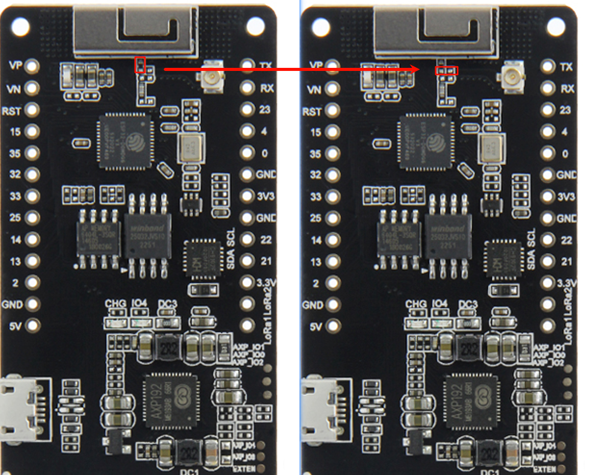

  

<h1 align = "center">🌟LilyGo T-Beam🌟</h1>

## Overview

* This page introduces the hardware parameters related to `LilyGo T-Beam`

### Notes on use

1. Please be sure to connect the antenna before transmitting, otherwise it is easy to damage the RF module

### Product

| Product                | SOC             | Flash         | PSRAM         |
| ---------------------- | --------------- | ------------- | ------------- |
| [T-Beam Meshtastic][1] | ESP32-D0WDQ6-V3 | 4MB(Quad-SPI) | 8MB(Quad-SPI) |
| [T-Beam SoftRF][2]     | ESP32-D0WDQ6-V3 | 4MB(Quad-SPI) | 8MB(Quad-SPI) |

[1]: https://www.lilygo.cc/products/t-beam-v1-1-esp32-lora-module "T-Beam Meshtastic"
[2]: https://www.lilygo.cc/products/t-beam-softrf "T-Beam SoftRF"

### PlatformIO Quick Start

1. Install the **CH9102 USB bridge** driver for the first time.
   * [Windows](https://www.wch-ic.com/downloads/CH343SER_ZIP.html)
   * [Mac OS](https://www.wch-ic.com/downloads/CH34XSER_MAC_ZIP.html)
2. Install [Visual Studio Code](https://code.visualstudio.com/) and [Python](https://www.python.org/)
3. Search for the `PlatformIO` plugin in the `Visual Studio Code` extension and install it.
4. After the installation is complete, you need to restart `Visual Studio Code`
5. After restarting `Visual Studio Code`, select `File` in the upper left corner of `Visual Studio Code` -> `Open Folder` -> select the `LilyGo-LoRa-Series` directory
6. Wait for the installation of third-party dependent libraries to complete
7. Click on the `platformio.ini` file, and in the `platformio` column
8. Select the board name you want to use in `default_envs` and uncomment it.
9. Uncomment one of the lines `src_dir = xxxx` to make sure only one line works , Please note the example comments, indicating what works and what does not.
10. Click the (✔) symbol in the lower left corner to compile
11. Connect the board to the computer USB-C , Micro-USB is used for module firmware upgrade
12. Click (→) to upload firmware
13. Click (plug symbol) to monitor serial output
14. If it cannot be written, or the USB device keeps flashing, please check the **FAQ** below

### Arduino IDE quick start

1. Install the **CH9102 USB bridge** driver for the first time.
   * [Windows](https://www.wch-ic.com/downloads/CH343SER_ZIP.html)
   * [Mac OS](https://www.wch-ic.com/downloads/CH34XSER_MAC_ZIP.html)
2. Install [Arduino IDE](https://www.arduino.cc/en/software)
3. Install [Arduino ESP32](https://docs.espressif.com/projects/arduino-esp32/en/latest/)
4. Copy all folders in the `lib` directory to the `Sketchbook location` directory. How to find the location of your own libraries, [please see here](https://support.arduino.cc/hc/en-us/articles/4415103213714-Find-sketches-libraries-board-cores-and-other-files-on-your-computer)
    * Windows: `C:\Users\{username}\Documents\Arduino`
    * macOS: `/Users/{username}/Documents/Arduino`
    * Linux: `/home/{username}/Arduino`
5. Open the corresponding example
    * Open the downloaded `LilyGo-LoRa-Series`
    * Open `examples`
    * Select the sample file and open the file ending with `ino`
6. On Arduino ISelect the corresponding board in the DE tool project and click on the corresponding option in the list below to select

    | Name                                 | Value                                |
    | ------------------------------------ | ------------------------------------ |
    | Board                                | **ESP32 Dev Module**                 |
    | Port                                 | Your port                            |
    | CPU Frequency                        | 240MHZ(WiFi/BT)                      |
    | Core Debug Level                     | None                                 |
    | Erase All Flash Before Sketch Upload | Disable                              |
    | Events Run On                        | Core1                                |
    | Flash Frequency                      | 80MHZ                                |
    | Flash Mode                           | QIO                                  |
    | Flash Size                           | **4MB(32Mb)**                        |
    | JTAG Adapter                         | Disabled                             |
    | Arduino Runs On                      | Core1                                |
    | Partition Scheme                     | **Huge APP (3MB No OTA/1MB SPIFFS)** |
    | PSRAM                                | **Enable**                           |
    | Upload Speed                         | 921600                               |
    | Programmer                           | **Esptool**                          |

6. Please uncomment the `utilities.h` file of each sketch according to your board model ,e.g `T_BEAM_SX1262`,`T_BEAM_SX1276`,`T_BEAM_SX1278`, otherwise the compilation will report an error.
7. Upload sketch

### 📍 Pins Map

| Name                          | GPIO NUM           | Free |
| ----------------------------- | ------------------ | ---- |
| SDA                           | 21                 | ❌    |
| SCL                           | 22                 | ❌    |
| OLED(**SSD1306**) SDA         | Share with I2C bus | ❌    |
| OLED(**SSD1306**) SCL         | Share with I2C bus | ❌    |
| GNSS(**Ublox M6/M8**) TX      | 12                 | ❌    |
| GNSS(**Ublox M6/M8**) RX      | 34                 | ❌    |
| LoRa(**SX1276/SX1278**) SCK   | 5                  | ❌    |
| LoRa(**SX1276/SX1278**) MISO  | 19                 | ❌    |
| LoRa(**SX1276/SX1278**) MOSI  | 27                 | ❌    |
| LoRa(**SX1276/SX1278**) RESET | 23                 | ❌    |
| LoRa(**SX1276/SX1278**) DIO1  | 33                 | ❌    |
| LoRa(**SX1276/SX1278**) DIO2  | 32                 | ❌    |
| LoRa(**SX1276/SX1278**) CS    | 18                 | ❌    |
| Button1                       | 38                 | ❌    |
| PMU (**AXP2101**) IRQ         | 35                 | ❌    |
| PMU (**AXP2101**) SDA         | Share with I2C bus | ❌    |
| PMU (**AXP2101**) SCL         | Share with I2C bus | ❌    |

### 🧑🏼‍🔧 I2C Devices Address

| Devices                     | 7-Bit Address | Share Bus |
| --------------------------- | ------------- | --------- |
| OLED Display (**SSD1306**)  | 0x3C          | ✅️         |
| Power Manager (**AXP2101**) | 0x34          | ❌         |

### ⚡ Electrical parameters

| Features             | Details                     |
| -------------------- | --------------------------- |
| 🔗USB-C Input Voltage | 3.9V-6V                     |
| ⚡Charge Current      | 0-1024mA (\(Programmable\)) |
| 🔋Battery Voltage     | 3.7V                        |

### ⚡ PowerManage Channel

| Channel    | Peripherals     |
| ---------- | --------------- |
| DC1        | **ESP32**       |
| DC2        | Unused          |
| DC3        | Unused          |
| DC4        | Unused          |
| DC5        | Unused          |
| LDO1(VRTC) | Unused          |
| ALDO1      | Unused          |
| ALDO2      | **Radio**       |
| ALDO3      | **GPS**         |
| ALDO4      | Unused          |
| BLDO1      | Unused          |
| BLDO2      | Unused          |
| DLDO1      | Unused          |
| CPUSLDO    | Unused          |
| VBACKUP    | **GNSS Backup** |

### Button Description

| Channel | Peripherals                       |
| ------- | --------------------------------- |
| PWR     | PMU button, customizable function |
| IO38    | Customizable function             |
| RST     | Reset button                      |

* The PWR button is connected to the PMU
  1. In shutdown mode, press the PWR button to turn on the power supply
  2. In power-on mode, press the PWR button for 6 seconds (default time) to turn off the power supply

### LED Description

* CHG LED
  1. If not controlled by the program, the default is always on when charging and off when fully charged
  2. This LED can be controlled by the program

* PPS LED,
  1. The red LED near the GPS module cannot be turned off
  2. This LED cannot be turned off and is connected to the GPS PPS Pin. This LED flashes to indicate that the PPS pulse has arrived.

### RF parameters

| Features            | Details                        |
| ------------------- | ------------------------------ |
| RF  Module          | SX1278/SX1276                  |
| Frequency range     | 868/915MHz                     |
| Transfer rate(LoRa) | 0.018 K ～ 62.5 Kbps           |
| Transfer rate(FSK)  | 0.6 K ～ 300 Kbps              |
| Modulation          | FSK, GFSK, MSK, GMSK, LoRa,OOK |

## WiFi-IPEX

* The following figure shows how to switch the onboard WIFI antenna to IPEX

### Resource

* [Schematic](../../../schematic/LilyGo_TBeam_V1.2.pdf)
* [AXP2101 datasheet](http://www.x-powers.com/en.php/Info/product_detail/article_id/95)
<!-- * [AXP192 datasheet](http://www.x-powers.com/en.php/Info/product_detail/article_id/29) -->
* [SX1262 datasheet](https://www.semtech.com/products/wireless-rf/lora-transceivers/sx1262)
* [SX1278 datasheet](https://www.semtech.com/products/wireless-rf/lora-transceivers/sx1278)
* [SX1276 datasheet](https://www.semtech.com/products/wireless-rf/lora-transceivers/sx1276)
* [SX1262 datasheet](https://www.semtech.com/products/wireless-rf/lora-transceivers/sx1262)
* [GSP NEO-6/NEO-8 datasheet](https://www.u-blox.com/en/product/neo-6-series)

### Application

* [T-Beam SoftRF](https://github.com/lyusupov/SoftRF)
* [T-Beam Paxcounter](https://github.com/cyberman54/ESP32-Paxcounter)
* [T-Beam Meshtastic](https://github.com/meshtastic/Meshtastic-device)

