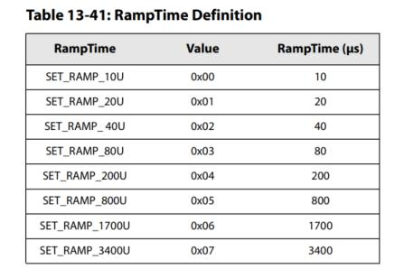
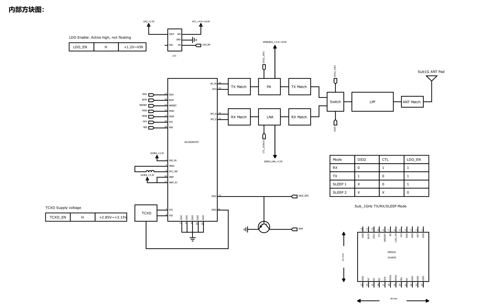
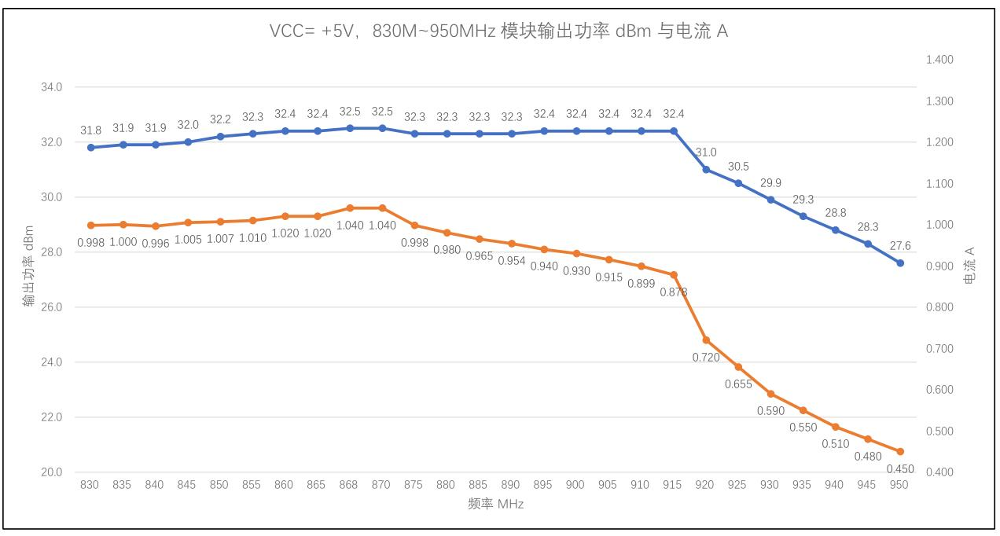

  

<h1 align = "center">🌟LilyGo T-Beam-1W🌟</h1>

## Overview

* This page introduces the hardware parameters related to `LilyGo T-Beam-1W`

### Notes on use

1. This board will not charge the external 7.4V battery, it is only powered by the battery.
2. Please be sure to connect the antenna before transmitting, otherwise it is easy to damage the RF module.
3. Please note that the GPIO with * added to the external pin header GPIO name is already connected to the internal module and cannot be used
4. This RF module provides a maximum power output of 32dBm on this board

## PlatformIO Quick Start

1. Install [Visual Studio Code](https://code.visualstudio.com/) and [Python](https://www.python.org/)
2. Search for the `PlatformIO` plugin in the `Visual Studio Code` extension and install it.
3. After the installation is complete, you need to restart `Visual Studio Code`
4. After restarting `Visual Studio Code`, select `File` in the upper left corner of `Visual Studio Code` -> `Open Folder` -> select the `LilyGo-LoRa-Series` directory
5. Wait for the installation of third-party dependent libraries to complete
6. Click on the `platformio.ini` file, and in the `platformio` column
7. Select the board name you want to use in `default_envs` and uncomment it.
8. Uncomment one of the lines `src_dir = xxxx` to make sure only one line works , Please note the example comments, indicating what works and what does not.
9. Click the (✔) symbol in the lower left corner to compile
10. Connect the board to the computer USB-C , Micro-USB is used for module firmware upgrade
11. Click (→) to upload firmware
12. Click (plug symbol) to monitor serial output
13. If it cannot be written, or the USB device keeps flashing, please check the **FAQ** below

## Arduino IDE quick start

1. Install [Arduino IDE](https://www.arduino.cc/en/software)
2. Install [Arduino ESP32](https://docs.espressif.com/projects/arduino-esp32/en/latest/)
3. Copy all folders in the `lib` directory to the `Sketchbook location` directory. How to find the location of your own libraries, [please see here](https://support.arduino.cc/hc/en-us/articles/4415103213714-Find-sketches-libraries-board-cores-and-other-files-on-your-computer)
    * Windows: `C:\Users\{username}\Documents\Arduino`
    * macOS: `/Users/{username}/Documents/Arduino`
    * Linux: `/home/{username}/Arduino`
4. Open the corresponding example
    * Open the downloaded `LilyGo-LoRa-Series`
    * Open `examples`
    * Select the sample file and open the file ending with `ino`
5. On Arduino ISelect the corresponding board in the DE tool project and click on the corresponding option in the list below to select

    | Name                                 | Value                               |
    | ------------------------------------ | ----------------------------------- |
    | Board                                | **ESP32S3 Dev Module**              |
    | Port                                 | Your port                           |
    | USB CDC On Boot                      | Enable                              |
    | CPU Frequency                        | 240MHZ(WiFi)                        |
    | Core Debug Level                     | None                                |
    | USB DFU On Boot                      | Disable                             |
    | Erase All Flash Before Sketch Upload | Disable                             |
    | Flash Mode                           | QIO 80Mhz                           |
    | Flash Size                           | **16MB(128Mb)**                     |
    | Arduino Runs On                      | Core1                               |
    | USB Firmware MSC On Boot             | Disable                             |
    | Partition Scheme                     | **16M Flash (3MB APP/9.9MB FATFS)** |
    | PSRAM                                | **OPI PSRAM**                       |
    | Upload Speed                         | 921600                              |
    | Programmer                           | **Esptool**                         |

6. Please uncomment the `utilities.h` file of each sketch according to your board model e.g `T_BEAM_1W`, otherwise the compilation will report an error.
7. Upload sketch

### 📍 Pins Map

| Name                    | GPIO NUM                       | Free |
| ----------------------- | ------------------------------ | ---- |
| Uart1 TX                | 43(External QWIIC Socket)      | ✅️    |
| Uart1 RX                | 44(External QWIIC Socket)      | ✅️    |
| SDA                     | 8 (External QWIIC Socket same) | ❌    |
| SCL                     | 9 (External QWIIC Socket same) | ❌    |
| SPI MOSI                | 11                             | ❌    |
| SPI MISO                | 12                             | ❌    |
| SPI SCK                 | 13                             | ❌    |
| SD CS                   | 10                             | ❌    |
| SD MOSI                 | Share with SPI bus             | ❌    |
| SD MISO                 | Share with SPI bus             | ❌    |
| SD SCK                  | Share with SPI bus             | ❌    |
| GNSS(**L76K**) TX       | 6                              | ❌    |
| GNSS(**L76K**) RX       | 5                              | ❌    |
| GNSS(**L76K**) PPS      | 7                              | ❌    |
| GNSS(**L76K**) Wake-up  | 16                             | ❌    |
| LoRa(**SX1262**) SCK    | Share with SPI bus             | ❌    |
| LoRa(**SX1262**) MISO   | Share with SPI bus             | ❌    |
| LoRa(**SX1262**) MOSI   | Share with SPI bus             | ❌    |
| LoRa(**SX1262**) RESET  | 3                              | ❌    |
| LoRa(**SX1262**) DIO1   | 1                              | ❌    |
| LoRa(**SX1262**) CS     | 15                             | ❌    |
| LoRa(**SX1262**) LDO EN | 40                             | ❌    |
| LoRa(**SX1262**) Ctrl   | 21                             | ❌    |
| LoRa(**SX1262**) BUSY   | 38                             | ❌    |
| Button1 (BOOT)          | 0                              | ❌    |
| Button2                 | 17                             | ❌    |
| On Board LED            | 18                             | ❌    |
| NTC ADC                 | 14                             | ❌    |
| Battery ADC             | 4                              | ❌    |
| Fan control             | 41                             | ❌    |

> \[!IMPORTANT]
> 
> LDO EN pin is control pin inside the module:
> 
> 1. High level turns on the Radio
> 2. Low level turns off the Radio
> 
> LoRa Ctrl pin is internal LNA power control of the module:
> 
> 1. When receiving data, set it to high level and turn on the LNA power;
> 2. When transmitting data and sleeping, set it to low level and turn off the LNA power.
>

### 🧑🏼‍🔧 I2C Devices Address

| Devices             | 7-Bit Address | Share Bus |
| ------------------- | ------------- | --------- |
| OLED Display SH1106 | 0x3C          | ✅️         |

### ⚡ Electrical parameters

| Features             | Details |
| -------------------- | ------- |
| 🔗USB-C Input Voltage | 3.9V-6V |
| ⚡Charge Function     | ❌       |
| 🔋Battery Voltage     | 7.4V    |

### Button Description

| Channel | Peripherals                    |
| ------- | ------------------------------ |
| IO17    | Customizable buttons           |
| BOOT    | Boot mode button, customizable |
| RST     | Reset button                   |

* The PWR button is connected to the PMU
  1. In shutdown mode, press the PWR button to turn on the power supply
  2. In power-on mode, press the PWR button for 6 seconds (default time) to turn off the power supply

### LED Description

* IO18 LED
  1. Connect to GPIO18, you can turn the LED on or off by writing high or low level.

* PPS LED
  1. This LED cannot be turned off and is connected to the GPS PPS Pin. This LED flashes to indicate that the PPS pulse has arrived.

* USB LED
  1. LED On means the USB cable is connected,LED off means the USB cable is disconnected

### RF parameters

| Features            | 868MHz                         | 433MHz                         |
| ------------------- | ------------------------------ | ------------------------------ |
| RF  Module          | SX1262 TCXO (XY16P35)          | SX1262 TCXO  XY16P354          |
| Frequency range     | 830~950MHz                     | 400~520MHz                     |
| Transfer rate(LoRa) | 0.018K～37.5Kbps               | 0.018K～37.5Kbps               |
| Transfer rate(FSK)  | 1.2K～300Kbps                  | 1.2K～300Kbps                  |
| Modulation          | FSK, GFSK, MSK, GMSK, LoRa,OOK | FSK, GFSK, MSK, GMSK, LoRa,OOK |

### Frequently asked questions

1. When testing or using, connect the antenna first, then power on to transmit the signal.
2. The module uses a high-gain, high-efficiency power amplifier. When the output power of SX1262 is +22dBm (max), the module output power is maximum.
3. Suggestion: Please give the internal PA stabilization time before transmitting data: For SX1262 chip, the recommended configuration value is >800us

  

4. When the module is ready to transmit/receive data, you need to switch the RF Switch on the module to the transmit/receive channel in advance. This switch is a single-pole double-throw switch. See the figure below for the truth table

| DIO2 PIN | CTRL PIN | RF Switch Status                                               |
| -------- | -------- | -------------------------------------------------------------- |
| 1        | 0        | ANT and TX channels connected, PA turned on, LNA powered off   |
| 0        | 1        | ANT and RX channels are connected, PA is closed, LNA is opened |

5. **During TX DATA, if the switch is not switched to the correct position in advance, the PA chip inside the module is likely to be damaged.**

### RF Block Diagram

### VCC=+5V, 400M~520MHz module output power dBm and current

### VCC=+5V, 830M~950MHz module output power dBm and current

### Resource

* [Schematic](../../../schematic/T-Beam_1W_V1.0.pdf)

