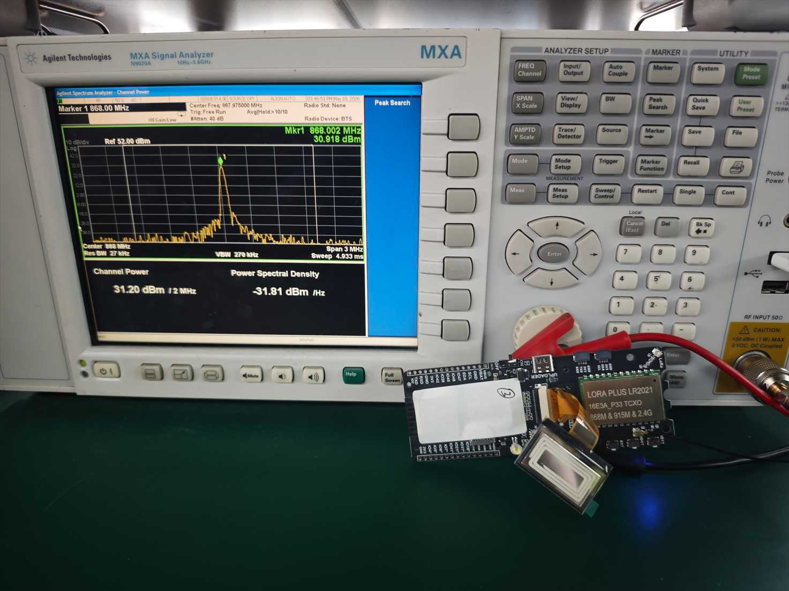
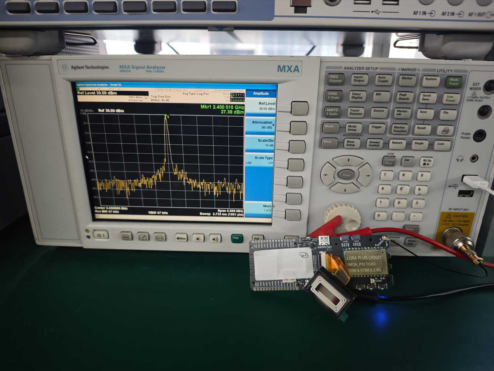
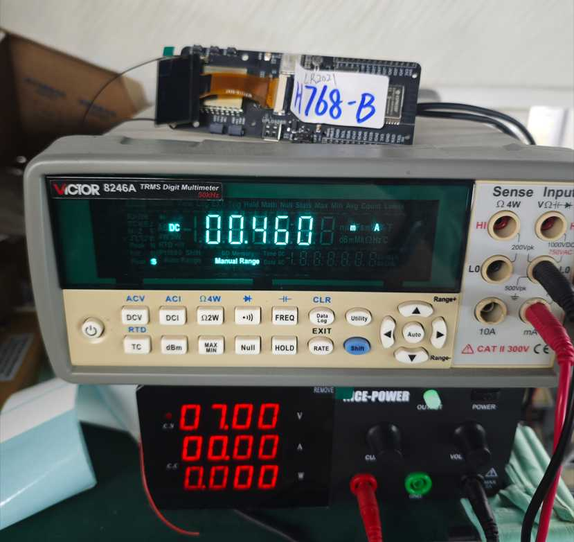

<div align="center" markdown="1">
  
</div>

<h1 align = "center">🌟LilyGo T-Beam-1W-LR2021</h1>

## Overview

* This page introduces the hardware parameters related to `LilyGo T-Beam-1W-LR2021`

### Notes on use

1. This board will not charge the external 7.4V battery, it is only powered by the battery.
2. Please be sure to connect the antenna before transmitting, otherwise it is easy to damage the RF module.
3. Please note that the GPIO with * added to the external pin header GPIO name is already connected to the internal module and cannot be used
4. This RF module provides a maximum power output of 30dBm on this board

## PlatformIO Quick Start

1. Install [Visual Studio Code](https://code.visualstudio.com/) and [Python](https://www.python.org/)
2. Search for the `PlatformIO` plugin in the `Visual Studio Code` extension and install it.
3. After the installation is complete, you need to restart `Visual Studio Code`
4. After restarting `Visual Studio Code`, select `File` in the upper left corner of `Visual Studio Code` -> `Open Folder` -> select the `LilyGo-LoRa-Series` directory
5. Wait for the installation of third-party dependent libraries to complete
6. Click on the `platformio.ini` file, and in the `platformio` column
7. Select the board name you want to use in `default_envs` and uncomment it.
8. Uncomment one of the lines `src_dir = xxxx` to make sure only one line works , Please note the example comments, indicating what works and what does not.
9. Click the (✔) symbol in the lower left corner to compile
10. Connect the board to the computer USB-C , Micro-USB is used for module firmware upgrade
11. Click (→) to upload firmware
12. Click (plug symbol) to monitor serial output
13. If it cannot be written, or the USB device keeps flashing, please check the **FAQ** below

## Arduino IDE quick start

1. Install [Arduino IDE](https://www.arduino.cc/en/software)
2. Install [Arduino ESP32](https://docs.espressif.com/projects/arduino-esp32/en/latest/)
3. Copy all folders in the `lib` directory to the `Sketchbook location` directory. How to find the location of your own libraries, [please see here](https://support.arduino.cc/hc/en-us/articles/4415103213714-Find-sketches-libraries-board-cores-and-other-files-on-your-computer)
    * Windows: `C:\Users\{username}\Documents\Arduino`
    * macOS: `/Users/{username}/Documents/Arduino`
    * Linux: `/home/{username}/Arduino`
4. Open the corresponding example
    * Open the downloaded `LilyGo-LoRa-Series`
    * Open `examples`
    * Select the sample file and open the file ending with `ino`
5. On Arduino Select the corresponding board in the IDE tool project and click on the corresponding option in the list below to select

    | Name                                 | Value                               |
    | ------------------------------------ | ----------------------------------- |
    | Board                                | **ESP32S3 Dev Module**              |
    | Port                                 | Your port                           |
    | USB CDC On Boot                      | Enable                              |
    | CPU Frequency                        | 240MHZ(WiFi)                        |
    | Core Debug Level                     | None                                |
    | USB DFU On Boot                      | Disable                             |
    | Erase All Flash Before Sketch Upload | Disable                             |
    | Flash Mode                           | QIO 80Mhz                           |
    | Flash Size                           | **16MB(128Mb)**                     |
    | Arduino Runs On                      | Core1                               |
    | USB Firmware MSC On Boot             | Disable                             |
    | Partition Scheme                     | **16M Flash (3MB APP/9.9MB FATFS)** |
    | PSRAM                                | **OPI PSRAM**                       |
    | Upload Speed                         | 921600                              |
    | Programmer                           | **Esptool**                         |

6. Please uncomment the `utilities.h` file of each sketch according to your board model e.g `T_BEAM_1W_LR2021`, otherwise the compilation will report an error.
7. Upload sketch

### 📍 Pins Map

| Name                    | GPIO NUM                       | Free |
| ----------------------- | ------------------------------ | ---- |
| Uart1 TX                | 43(External QWIIC Socket)      | ✅️    |
| Uart1 RX                | 44(External QWIIC Socket)      | ✅️    |
| SDA                     | 8 (External QWIIC Socket same) | ❌    |
| SCL                     | 9 (External QWIIC Socket same) | ❌    |
| SPI MOSI                | 11                             | ❌    |
| SPI MISO                | 12                             | ❌    |
| SPI SCK                 | 13                             | ❌    |
| SD CS                   | 10                             | ❌    |
| SD MOSI                 | Share with SPI bus             | ❌    |
| SD MISO                 | Share with SPI bus             | ❌    |
| SD SCK                  | Share with SPI bus             | ❌    |
| GNSS(**L76K**) TX       | 6                              | ❌    |
| GNSS(**L76K**) RX       | 5                              | ❌    |
| GNSS(**L76K**) PPS      | 7                              | ❌    |
| GNSS(**L76K**) Wake-up  | 16                             | ❌    |
| LoRa(**LR2021**) SCK    | Share with SPI bus             | ❌    |
| LoRa(**LR2021**) MISO   | Share with SPI bus             | ❌    |
| LoRa(**LR2021**) MOSI   | Share with SPI bus             | ❌    |
| LoRa(**LR2021**) RESET  | 3                              | ❌    |
| LoRa(**LR2021**) DIO10  | 1                              | ❌    |
| LoRa(**LR2021**) DIO11  | 21                             | ❌    |
| LoRa(**LR2021**) CS     | 15                             | ❌    |
| LoRa(**LR2021**) LDO EN | 40                             | ❌    |
| LoRa(**LR2021**) BUSY   | 38                             | ❌    |
| Button1 (BOOT)          | 0                              | ❌    |
| Button2                 | 17                             | ❌    |
| On Board LED            | 18                             | ❌    |
| NTC ADC                 | 14                             | ❌    |
| Battery ADC             | 4                              | ❌    |
| Fan control             | 41                             | ❌    |

> \[!IMPORTANT]
> 
> The LDO EN pin controls the power supply of LoRa.
> 
> 1. High level turns on the Radio
> 2. Low level turns off the Radio
>

### 🧑🏼‍🔧 I2C Devices Address

| Devices             | 7-Bit Address | Share Bus |
| ------------------- | ------------- | --------- |
| OLED Display SH1106 | 0x3C          | ✅️         |

### ⚡ Electrical parameters

| Features             | Details |
| -------------------- | ------- |
| 🔗USB-C Input Voltage | 3.9V-6V |
| ⚡Charge Function     | ❌       |
| 🔋Battery Voltage     | 7.4V    |

> \[!IMPORTANT]
>
> The battery used must have a discharge capacity of 2A or greater; otherwise, it may trigger battery protection during high-power transmission.
>

### Button Description

| Channel | Peripherals                    |
| ------- | ------------------------------ |
| IO17    | Customizable buttons           |
| BOOT    | Boot mode button, customizable |
| RST     | Reset button                   |

### LED Description

* IO18 LED
  1. Connect to GPIO18, you can turn the LED on or off by writing high or low level.

* PPS LED
  1. This LED cannot be turned off and is connected to the GPS PPS Pin. This LED flashes to indicate that the PPS pulse has arrived.

* USB LED
  1. LED On means the USB cable is connected,LED off means the USB cable is disconnected

### RF parameters

| Features                            | LR2021          (XY16E3AXP33) |
| ----------------------------------- | ----------------------------- |
| RF  Module                          | LR2021 TCXO                   |
| Frequency range                     | 840 ~ 930MHz                  |
| Transfer rate(FSK)                  | 0.5 ~ 2000 kbps               |
| Transfer rate(LoRa Sub1G)           | 0.091 ~ 62.5kbps              |
| Transfer rate(FSK 2.4G)             | 0.476 ~ 101.5 Kbps            |
| Transfer rate(FLRC)                 | 0.13 ~ 2.6 Mbps               |
| Modulation                          | FSK, MSK, LoRa ,FLRC          |
| Sub1G PA Gain [HM06S006P][1]        | ~ +12dBm                      |
| Sub1G LNA Gain                      | N.A                           |
| 2.4G PA Gain   [CB5337CX][2]        | ~ +34dBm                      |
| 2.4G LNA Gain  [CB5337CX][2]        | ~ +15dBm                      |
| 2.4G LNA allows maximum input power | +5dBm                         |

[1]: ../../datasheet/HM06S006P_V2.0.pdf
[2]: ../../datasheet/CB5337CX_Datasheet_A2.1_EN.pdf

### RadioLib RF Setting

```c
// LR2021 Version PA RF switch table
static const uint32_t pa_version_rf_switch_dio_pins[] = {
    RADIOLIB_LR2021_DIO5, RADIOLIB_LR2021_DIO6, RADIOLIB_LR2021_DIO7, RADIOLIB_LR2021_DIO8, RADIOLIB_NC
};

static const Module::RfSwitchMode_t low_sub1g_switch_table[] = {
    // mode                  DIO5  DIO6 DIO7 DIO8
    { LR2021::MODE_STBY,   { LOW,  LOW, LOW, LOW} },
    { LR2021::MODE_TX,     { LOW,  LOW, LOW, HIGH} }, // Sub1G DIO8 SET HIGH
    { LR2021::MODE_RX,     { LOW,  LOW, LOW, LOW} },  // Sub1G ALL DIO SET LOW
    { LR2021::MODE_RX_HF,  { LOW,  LOW, LOW, LOW} },
    { LR2021::MODE_TX_HF,  { LOW,  LOW, LOW, LOW} },
    END_OF_MODE_TABLE,
};

static const Module::RfSwitchMode_t high_2g4_switch_table[] = {
    // mode                  DIO5  DIO6 DIO7 DIO8
    { LR2021::MODE_STBY,   { LOW,  LOW, LOW, LOW} },
    { LR2021::MODE_TX,     { LOW,  LOW, LOW, LOW} },
    { LR2021::MODE_RX,     { LOW,  LOW, LOW, LOW} },
    { LR2021::MODE_RX_HF,  { LOW,  HIGH, LOW, LOW} }, // 2.4G RX DIO6 SET HIGH
    { LR2021::MODE_TX_HF,  { LOW,  LOW, HIGH, LOW} }, // 2.4G TX DIO7 SET HIGH
    END_OF_MODE_TABLE,
};

```

> \[!IMPORTANT]
> 2.4G power setting must not exceed 8dBm, otherwise it may damage the PA. When using 2.4G, please limit the power to 8dBm or below.
>
> The maximum settable power for Sub1G is 22dBm.
>

### RF Block Diagram


### VCC=+5V, 840MHz~930MHz module output power dBm and current


### VCC=+5V, 2400MHz~2500MHz module output power dBm and current


### Resource

* [Schematic](../../../schematic/T-Beam_1W_V1.1.pdf)

 # Max Transmit power  

| Freq   | Max Transmit power                  |
| ------ | ----------------------------------- |
| 868MHz |  |
| 2.4G   |     |

# Sleep Current



* All the above tests were conducted using a battery-powered system with a voltage of 7V
