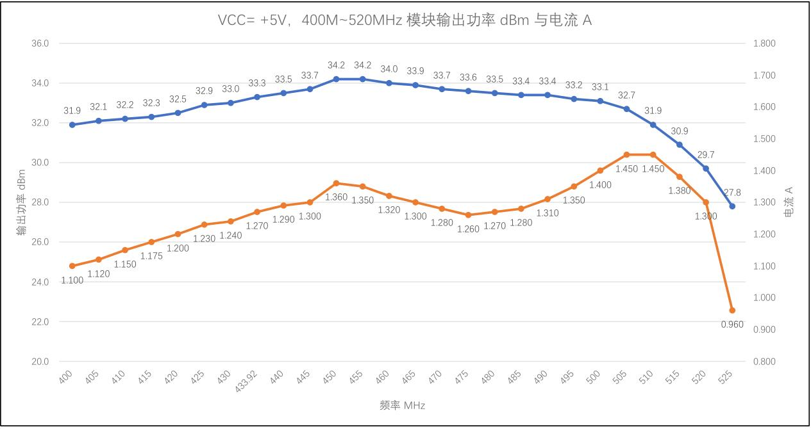
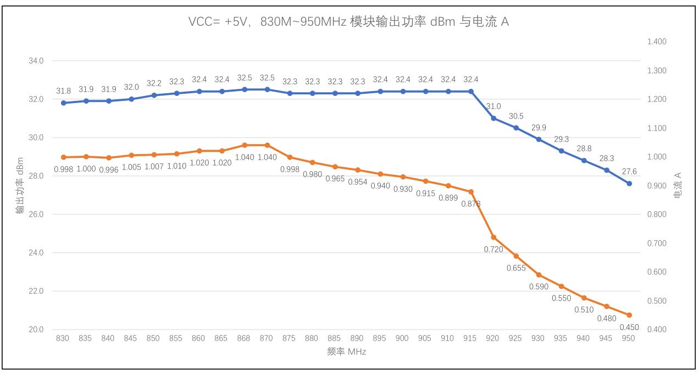

  

<h1 align = "center">🌟LilyGo T-Beam-2W🌟</h1>

## Overview

* This page introduces the hardware parameters related to `LilyGo T-Beam-2W`

### Notes on use

1. This board will not charge the external 7.4V battery, it is only powered by the battery.
2. Please be sure to connect the antenna before transmitting, otherwise it is easy to damage the RF module.
3. Please note that the GPIO with * added to the external pin header GPIO name is already connected to the internal module and cannot be used
4. This RF module provides a maximum power output of 32dBm on this board

### 📍 Pins Map

| Name                    | GPIO NUM                       | Free |
| ----------------------- | ------------------------------ | ---- |
| Uart1 TX                | 43(External QWIIC Socket)      | ✅️    |
| Uart1 RX                | 44(External QWIIC Socket)      | ✅️    |
| SDA                     | 8 (External QWIIC Socket same) | ❌    |
| SCL                     | 9 (External QWIIC Socket same) | ❌    |
| SPI MOSI                | 11                             | ❌    |
| SPI MISO                | 12                             | ❌    |
| SPI SCK                 | 13                             | ❌    |
| SD CS                   | 10                             | ❌    |
| SD MOSI                 | Share with SPI bus             | ❌    |
| SD MISO                 | Share with SPI bus             | ❌    |
| SD SCK                  | Share with SPI bus             | ❌    |
| GNSS(**L76K**) TX       | 6                              | ❌    |
| GNSS(**L76K**) RX       | 5                              | ❌    |
| GNSS(**L76K**) PPS      | 7                              | ❌    |
| GNSS(**L76K**) Wake-up  | 16                             | ❌    |
| LoRa(**SX1262**) SCK    | Share with SPI bus             | ❌    |
| LoRa(**SX1262**) MISO   | Share with SPI bus             | ❌    |
| LoRa(**SX1262**) MOSI   | Share with SPI bus             | ❌    |
| LoRa(**SX1262**) RESET  | 3                              | ❌    |
| LoRa(**SX1262**) DIO1   | 1                              | ❌    |
| LoRa(**SX1262**) CS     | 15                             | ❌    |
| LoRa(**SX1262**) LDO EN | 40                             | ❌    |
| LoRa(**SX1262**) Ctrl   | 21                             | ❌    |
| LoRa(**SX1262**) BUSY   | 38                             | ❌    |
| Button1 (BOOT)          | 0                              | ❌    |
| Button2                 | 17                             | ❌    |
| On Board LED            | 18                             | ❌    |
| NTC ADC                 | 14                             | ❌    |
| Battery ADC             | 4                              | ❌    |
| Fan control             | 41                             | ❌    |

> \[!IMPORTANT]
> 
> LDO EN pin is control pin inside the module:
> 
> 1. High level turns on the Radio
> 2. Low level turns off the Radio
> 
> LoRa Ctrl pin is internal LNA power control of the module:
> 
> 1. When receiving data, set it to high level and turn on the LNA power;
> 2. When transmitting data and sleeping, set it to low level and turn off the LNA power.
>

### 🧑🏼‍🔧 I2C Devices Address

| Devices             | 7-Bit Address | Share Bus |
| ------------------- | ------------- | --------- |
| OLED Display SH1106 | 0x3C          | ✅️         |

### ⚡ Electrical parameters

| Features             | Details |
| -------------------- | ------- |
| 🔗USB-C Input Voltage | 3.9V-6V |
| ⚡Charge Function     | ❌       |
| 🔋Battery Voltage     | 7.4V    |

### Button Description

| Channel | Peripherals                    |
| ------- | ------------------------------ |
| IO17    | Customizable buttons           |
| BOOT    | Boot mode button, customizable |
| RST     | Reset button                   |

* The PWR button is connected to the PMU
  1. In shutdown mode, press the PWR button to turn on the power supply
  2. In power-on mode, press the PWR button for 6 seconds (default time) to turn off the power supply

### LED Description

* IO18 LED
  1. Connect to GPIO18, you can turn the LED on or off by writing high or low level.

* PPS LED
  1. This LED cannot be turned off and is connected to the GPS PPS Pin. This LED flashes to indicate that the PPS pulse has arrived.

* USB LED
  1. LED On means the USB cable is connected,LED off means the USB cable is disconnected

### RF parameters

| Features            | Details                        |
| ------------------- | ------------------------------ |
| RF  Module          | SX1262 TCXO (XY16P35)          |
| Frequency range     | 144~148MHZ                     |
| Transfer rate(LoRa) | 0.018K～37.5Kbps               |
| Transfer rate(FSK)  | 1.2K～300Kbps                  |
| Modulation          | FSK, GFSK, MSK, GMSK, LoRa,OOK |

### Frequently asked questions

1. When testing or using, connect the antenna first, then power on to transmit the signal.
2. The module uses a high-gain, high-efficiency power amplifier. When the output power of SX1262 is +22dBm (max), the module output power is maximum.
3. Suggestion: Please give the internal PA stabilization time before transmitting data: For SX1262 chip, the recommended configuration value is >800us

4. When the module is ready to transmit/receive data, you need to switch the RF Switch on the module to the transmit/receive channel in advance. This switch is a single-pole double-throw switch. See the figure below for the truth table

| DIO2 PIN | CTRL PIN | RF Switch Status                                               |
| -------- | -------- | -------------------------------------------------------------- |
| 1        | 0        | ANT and TX channels connected, PA turned on, LNA powered off   |
| 0        | 1        | ANT and RX channels are connected, PA is closed, LNA is opened |

5. **During TX DATA, if the switch is not switched to the correct position in advance, the PA chip inside the module is likely to be damaged.**

### RF Block Diagram

### VCC=+5V, 400M~520MHz module output power dBm and current

### VCC=+5V, 830M~950MHz module output power dBm and current

### Resource

* [Schematic](../../../schematic/T-Beam_2W_V1.0.pdf)

