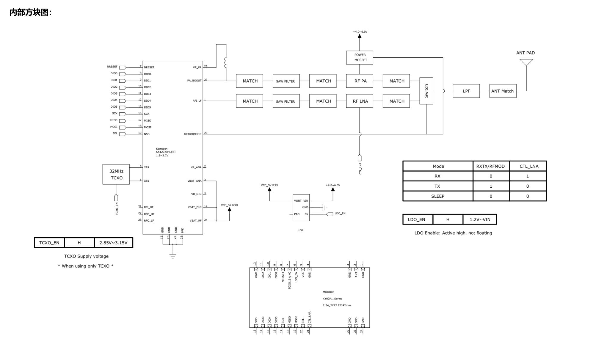

  

<h1 align = "center">🌟LilyGo T-Beam-BPF🌟</h1>

## Overview

* This page introduces the hardware parameters related to `LilyGo T-Beam-BPF`

### Notes on use

1. The device will not be powered when the battery is inserted for the first time, because the onboard BMS is in shipping mode at this time. You need to exit shipping mode and insert the USB-C into the board to activate the device power supply. If the battery is removed and re-inserted, you need to repeat the above steps
2. Please be sure to connect the antenna before transmitting, otherwise it is easy to damage the RF module

### 📍 Pins Map

| Name                    | GPIO NUM                       | Free |
| ----------------------- | ------------------------------ | ---- |
| Uart1 TX                | 43(External QWIIC Socket)      | ✅️    |
| Uart1 RX                | 44(External QWIIC Socket)      | ✅️    |
| SDA                     | 8 (External QWIIC Socket same) | ❌    |
| SCL                     | 9 (External QWIIC Socket same) | ❌    |
| OLED(**SH1106**) SDA    | Share with I2C bus             | ❌    |
| OLED(**SH1106**) SCL    | Share with I2C bus             | ❌    |
| SPI MOSI                | 11                             | ❌    |
| SPI MISO                | 13                             | ❌    |
| SPI SCK                 | 12                             | ❌    |
| SD CS                   | 10                             | ❌    |
| SD MOSI                 | Share with SPI bus             | ❌    |
| SD MISO                 | Share with SPI bus             | ❌    |
| SD SCK                  | Share with SPI bus             | ❌    |
| GNSS(**L76K**) TX       | 6                              | ❌    |
| GNSS(**L76K**) RX       | 5                              | ❌    |
| GNSS(**L76K**) PPS      | 7                              | ❌    |
| LoRa(**SX1278**) SCK    | Share with SPI bus             | ❌    |
| LoRa(**SX1278**) MISO   | Share with SPI bus             | ❌    |
| LoRa(**SX1278**) MOSI   | Share with SPI bus             | ❌    |
| LoRa(**SX1278**) RESET  | 18                             | ❌    |
| LoRa(**SX1278**) DIO0   | 14                             | ❌    |
| LoRa(**SX1278**) DIO1   | 21                             | ❌    |
| LoRa(**SX1278**) CS     | 1                              | ❌    |
| LoRa(**SX1278**) LDO EN | 16                             | ❌    |
| LoRa(**SX1278**) Ctrl   | 39                             | ❌    |
| Button1 (BOOT)          | 0                              | ❌    |
| Button2                 | 3                              | ❌    |
| PMU (**AXP2101**) IRQ   | 4                              | ❌    |
| PMU (**AXP2101**) SDA   | Share with I2C bus             | ❌    |
| PMU (**AXP2101**) SCL   | Share with I2C bus             | ❌    |

> \[!IMPORTANT]
> 
> LDO EN pin is control pin inside the module:
> 
> 1. High level turns on the Radio
> 2. Low level turns off the Radio
> 
> LoRa Ctrl pin is internal LNA power control of the module:
> 
> 1. When receiving data, set it to high level and turn on the LNA power;
> 2. When transmitting data and sleeping, set it to low level and turn off the LNA power.
>

### 🧑🏼‍🔧 I2C Devices Address

| Devices               | 7-Bit Address | Share Bus |
| --------------------- | ------------- | --------- |
| OLED Display SH1106   | 0x3C          | ✅️         |
| Power Manager AXP2101 | 0x34          | ✅️         |

### ⚡ Electrical parameters

| Features             | Details                     |
| -------------------- | --------------------------- |
| 🔗USB-C Input Voltage | 3.9V-6V                     |
| ⚡Charge Current      | 0-1024mA (\(Programmable\)) |
| 🔋Battery Voltage     | 3.7V                        |

### ⚡ PowerManage Channel

| Channel    | Peripherals         |
| ---------- | ------------------- |
| DC1        | **ESP32-S3**        |
| DC2        | Unused              |
| DC3        | External pin header |
| DC4        | Unused              |
| DC5        | External pin header |
| LDO1(VRTC) | Unused              |
| ALDO1      | External pin header |
| ALDO2      | **SD Card**         |
| ALDO3      | External pin header |
| ALDO4      | **GNSS**            |
| BLDO1      | Unused              |
| BLDO2      | External pin header |
| DLDO1      | Unused              |
| CPUSLDO    | Unused              |
| VBACKUP    | Unused              |

### Button Description

| Channel | Peripherals                       |
| ------- | --------------------------------- |
| IO3     | Customizable buttons              |
| PWR     | PMU button, customizable function |
| BOOT    | Boot mode button, customizable    |
| RST     | Reset button                      |

* The PWR button is connected to the PMU
  1. In shutdown mode, press the PWR button to turn on the power supply
  2. In power-on mode, press the PWR button for 6 seconds (default time) to turn off the power supply

### LED Description

* CHG LED
  1. If not controlled by the program, the default is always on when charging and off when fully charged
  2. This LED can be controlled by the program

* PPS LED
  1. This LED cannot be turned off and is connected to the GPS PPS Pin. This LED flashes to indicate that the PPS pulse has arrived.

### RF parameters

| Features            | Details                        |
| ------------------- | ------------------------------ |
| RF  Module          | SX1278 TCXO (XP02P181T)        |
| Frequency range     | 144~148MHZ                     |
| Transfer rate(LoRa) | 0.018K～37.5Kbps               |
| Transfer rate(FSK)  | 1.2K～300Kbps                  |
| Modulation          | FSK, GFSK, MSK, GMSK, LoRa,OOK |

> \[!IMPORTANT]
> 
> Note:
> 1. When testing or using, connect the antenna first, then power on to transmit the signal.
> 2. First switch the RF switch tube to the TX/RX channel, and then transmit/receive the signal: RXTX/RFMOD of the > SX127X chip is high, the RF switch
> tube is switched to the TX channel, and low, the RF switch tube is switched to the RX channel.
> 3. Control the SX127X chip, the output power is +10dBM, not exceeding +12dBm.
> 4. When the module is dormant, RXTX/RFMOD, CTL_LNA, is low. At this time, if it is a TCXO crystal oscillator, TCXO_EN is high, the module will not
> really sleep, and the TCXO crystal oscillator consumes 2.5mA. If TCXO_EN is low, all configuration parameters of > SX127X are lost, the module is truly dormant, and
> when it is started again, the SX127X needs to be reinitialized.

### RF Block Diagram

