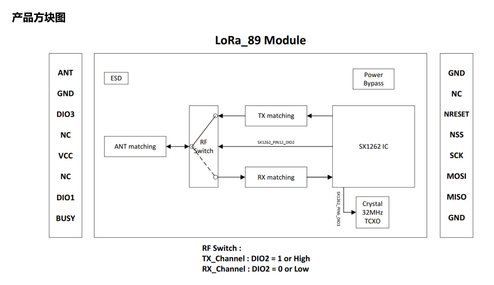

  

<h1 align = "center">🌟LilyGo T-Beam-Supreme🌟</h1>

## Overview

* This page introduces the hardware parameters related to `LilyGo T-Beam-Supreme`

### Notes on use

1. Please be sure to connect the antenna before transmitting, otherwise it is easy to damage the RF module
2. The antenna of the LR1121 version is above the Radio module, and the Sub 1G antenna is on the PCB LoRa silkscreen.

### Product

| Product                      | SOC         | Flash         | PSRAM         |
| ---------------------------- | ----------- | ------------- | ------------- |
| [T-Beam S3 Supreme L76K][1]  | ESP32-S3FN8 | 8MB(Quad-SPI) | 8MB(Quad-SPI) |
| [T-Beam S3 Supreme Ublox][2] | ESP32-S3FN8 | 8MB(Quad-SPI) | 8MB(Quad-SPI) |

[1]: https://www.lilygo.cc/products/softrf-t-beamsupreme?variant=42880905052341 "T-Beam S3 Supreme L76K"
[2]: https://www.lilygo.cc/products/softrf-t-beamsupreme?variant=42880905281717 "T-Beam S3 Supreme Ublox"

## PlatformIO Quick Start

1. Install [Visual Studio Code](https://code.visualstudio.com/) and [Python](https://www.python.org/)
2. Search for the `PlatformIO` plugin in the `Visual Studio Code` extension and install it.
3. After the installation is complete, you need to restart `Visual Studio Code`
4. After restarting `Visual Studio Code`, select `File` in the upper left corner of `Visual Studio Code` -> `Open Folder` -> select the `LilyGo-LoRa-Series` directory
5. Wait for the installation of third-party dependent libraries to complete
6. Click on the `platformio.ini` file, and in the `platformio` column
7. Select the board name you want to use in `default_envs` and uncomment it.
8. Uncomment one of the lines `src_dir = xxxx` to make sure only one line works , Please note the example comments, indicating what works and what does not.
9. Click the (✔) symbol in the lower left corner to compile
10. Connect the board to the computer USB-C , Micro-USB is used for module firmware upgrade
11. Click (→) to upload firmware
12. Click (plug symbol) to monitor serial output
13. If it cannot be written, or the USB device keeps flashing, please check the **FAQ** below

## Arduino IDE quick start

1. Install [Arduino IDE](https://www.arduino.cc/en/software)
2. Install [Arduino ESP32](https://docs.espressif.com/projects/arduino-esp32/en/latest/)
3. Copy all folders in the `lib` directory to the `Sketchbook location` directory. How to find the location of your own libraries, [please see here](https://support.arduino.cc/hc/en-us/articles/4415103213714-Find-sketches-libraries-board-cores-and-other-files-on-your-computer)
    * Windows: `C:\Users\{username}\Documents\Arduino`
    * macOS: `/Users/{username}/Documents/Arduino`
    * Linux: `/home/{username}/Arduino`
4. Open the corresponding example
    * Open the downloaded `LilyGo-LoRa-Series`
    * Open `examples`
    * Select the sample file and open the file ending with `ino`
5. On Arduino ISelect the corresponding board in the DE tool project and click on the corresponding option in the list below to select

    | Name                                 | Value                             |
    | ------------------------------------ | --------------------------------- |
    | Board                                | **ESP32S3 Dev Module**            |
    | Port                                 | Your port                         |
    | USB CDC On Boot                      | Enable                            |
    | CPU Frequency                        | 240MHZ(WiFi)                      |
    | Core Debug Level                     | None                              |
    | USB DFU On Boot                      | Disable                           |
    | Erase All Flash Before Sketch Upload | Disable                           |
    | Events Run On                        | Core1                             |
    | Flash Mode                           | QIO 80MHZ                         |
    | Flash Size                           | **8MB(64Mb)**                     |
    | Arduino Runs On                      | Core1                             |
    | USB Firmware MSC On Boot             | Disable                           |
    | Partition Scheme                     | **8M Flash(3M APP/1.5MB SPIFFS)** |
    | PSRAM                                | **QSPI PSRAM**                    |
    | Upload Mode                          | **UART0/Hardware CDC**            |
    | Upload Speed                         | 921600                            |
    | USB Mode                             | **CDC and JTAG**                  |
    | Programmer                           | **Esptool**                       |

6. Please uncomment the `utilities.h` file of each sketch according to your board model e.g `T_BEAM_S3_SUPREME_SX1262` or `T_BEAM_S3_SUPREME_LR1121`, otherwise the compilation will report an error.
7. Upload sketch

### 📍 Pins Map

| Name                                 | GPIO NUM                   | Free |
| ------------------------------------ | -------------------------- | ---- |
| Uart1 TX                             | 43(External QWIIC Socket)  | ✅️    |
| Uart1 RX                             | 44(External QWIIC Socket)  | ✅️    |
| SDA                                  | 17                         | ❌    |
| SCL                                  | 18                         | ❌    |
| OLED(**SH1106**) SDA                 | Share with I2C bus         | ❌    |
| OLED(**SH1106**) SCL                 | Share with I2C bus         | ❌    |
| RTC(**PCF8563**) SDA                 | Share with **PMU** I2C bus | ❌    |
| RTC(**PCF8563**) SCL                 | Share with **PMU** I2C bus | ❌    |
| MAG Sensor(**QMC6310**) SDA          | Share with I2C bus         | ❌    |
| MAG Sensor(**QMC6310**) SCL          | Share with I2C bus         | ❌    |
| RTC(**PCF8563**) Interrupt           | 14                         | ❌    |
| IMU Sensor(**QMI8658**) Interrupt    | 33                         | ❌    |
| IMU Sensor(**QMI8658**) MISO         | Share with SPI bus         | ❌    |
| IMU Sensor(**QMI8658**) MOSI         | Share with SPI bus         | ❌    |
| IMU Sensor(**QMI8658**) SCK          | Share with SPI bus         | ❌    |
| IMU Sensor(**QMI8658**) CS           | 34                         | ❌    |
| SPI MOSI                             | 35                         | ❌    |
| SPI MISO                             | 37                         | ❌    |
| SPI SCK                              | 36                         | ❌    |
| SD CS                                | 47                         | ❌    |
| SD MOSI                              | Share with SPI bus         | ❌    |
| SD MISO                              | Share with SPI bus         | ❌    |
| SD SCK                               | Share with SPI bus         | ❌    |
| GNSS(**L76K or Ublox M10**) TX       | 8                          | ❌    |
| GNSS(**L76K or Ublox M10**) RX       | 9                          | ❌    |
| GNSS(**L76K or Ublox M10**) PPS      | 6                          | ❌    |
| GNSS(**L76K**) Wake-up               | 7                          | ❌    |
| LoRa(**SX1262 or LR1121**) SCK       | 12                         | ❌    |
| LoRa(**SX1262 or LR1121**) MISO      | 13                         | ❌    |
| LoRa(**SX1262 or LR1121**) MOSI      | 11                         | ❌    |
| LoRa(**SX1262 or LR1121**) RESET     | 5                          | ❌    |
| LoRa(**SX1262 or LR1121**) DIO1/DIO9 | 1                          | ❌    |
| LoRa(**SX1262 or LR1121**) BUSY      | 4                          | ❌    |
| LoRa(**SX1262 or LR1121**) CS        | 10                         | ❌    |
| Button1 (BOOT)                       | 0                          | ❌    |
| PMU (**AXP2101**) IRQ                | 40                         | ❌    |
| PMU (**AXP2101**) SDA                | 42                         | ❌    |
| PMU (**AXP2101**) SCL                | 41                         | ❌    |

> \[!IMPORTANT]
> 
> 1. GNSS Wake-up is only available in L76K version
> 
> 2. Radio has its own SPI bus, and other peripheral SPI devices share the SPI bus.

### 🧑🏼‍🔧 I2C Devices Address

| Devices                                 | 7-Bit Address | Share Bus      |
| --------------------------------------- | ------------- | -------------- |
| OLED Display (**SH1106**)               | 0x3C          | ✅️  (I2C Bus 0) |
| MAG Sensor(**QMC6310U**)                | 0x1C          | ✅️  (I2C Bus 0) |
| Temperature/humidity Sensor(**BME280**) | 0x77          | ✅️  (I2C Bus 0) |
| RTC (**PCF8563**)                       | 0x51          | ❌ (I2C Bus 1)  |
| Power Manager (**AXP2101**)             | 0x34          | ❌ (I2C Bus 1)  |

> \[!IMPORTANT]
> If the I2C device is connected to pins 17 (SDA) or 18 (SCL)
> the sensor power supply must be connected to DC1. If connected to other LDOs
> the power must be turned on before accessing the sensor I2C bus
> otherwise, the I2C access will fail or freeze.
>

### BME280 Address

* If you need to change the BME280 device address, you can remove the resistor and then connect it to the fixed pad via a wire. This will change the device address to 0x76.

<a href="./images/BME.png" style="text-decoration: none; display: block;">

### ⚡ Electrical parameters

| Features             | Details                     |
| -------------------- | --------------------------- |
| 🔗USB-C Input Voltage | 3.9V-6V                     |
| ⚡Charge Current      | 0-1024mA (\(Programmable\)) |
| 🔋Battery Voltage     | 3.7V                        |

### ⚡ PowerManage Channel

| Channel    | Peripherals                              | Max Current                              |
| ---------- | ---------------------------------------- | ---------------------------------------- |
| DC1        | **ESP32-S3**                             | 2A(Includes ESP operating current 800mA) |
| DC2        | Unused                                   | X                                        |
| DC3        | External M.2 Socket                      | 2A                                       |
| DC4        | External M.2 Socket                      | 1.5A                                     |
| DC5        | External M.2 Socket                      | 1A                                       |
| LDO1(VRTC) | Unused                                   | X                                        |
| ALDO1      | **BME280 Sensor & Display & MAG Sensor** | X                                        |
| ALDO2      | **Sensor**                               | X                                        |
| ALDO3      | **Radio**                                | X                                        |
| ALDO4      | **GPS**                                  | X                                        |
| BLDO1      | **SD Card**                              | X                                        |
| BLDO2      | External pin header                      | 300mA                                    |
| DLDO1      | Unused                                   | X                                        |
| CPUSLDO    | Unused                                   | X                                        |
| VBACKUP    | Unused                                   | X                                        |

* T-Beam Supreme GPS backup power comes from 18650 battery. If you remove the 18650 battery, you will not be able to get GPS hot start. If you need to use GPS hot start, please connect the 18650 battery.

### Button Description

| Channel | Peripherals                       |
| ------- | --------------------------------- |
| PWR     | PMU button, customizable function |
| BOOT    | Boot mode button, customizable    |
| RST     | Reset button                      |

* The PWR button is connected to the PMU
  1. In shutdown mode, press the PWR button to turn on the power supply
  2. In power-on mode, press the PWR button for 6 seconds (default time) to turn off the power supply

### LED Description

* CHG LED
  1. If not controlled by the program, the default is always on when charging and off when fully charged
  2. This LED can be controlled by the program

* PPS LED
  1. This LED cannot be turned off and is connected to the GPS PPS Pin. This LED flashes to indicate that the PPS pulse has arrived.

### SX1262 RF parameters

| Features            | Details                        |
| ------------------- | ------------------------------ |
| RF  Module          | SX1262                         |
| Frequency range     | 868/915MHz                     |
| Transfer rate(LoRa) | 0.018 K ～ 62.5 Kbps           |
| Transfer rate(FSK)  | 0.6 K ～ 300 Kbps              |
| Modulation          | FSK, GFSK, MSK, GMSK, LoRa,OOK |

### SX1262 RF Block Diagram

### LR1121 RF parameters

| Features            | Details                       |
| ------------------- | ----------------------------- |
| RF  Module          | LR1121                        |
| Frequency range     | 830-945MHz，2.4-2.5GHz        |
| Transfer rate(LoRa) | 0.6 K~300 Kbps@FSK@ Sub1G     |
| Transfer rate(FSK)  | 0.018 K~62.5 Kbps@LoRa@ Sub1G |
| Transfer rate(FSK)  | 0.476 K~101.5 Kbps@LoRa@ 2.4G |
| Modulation          | LoRa,(G)FSK ，LR-FHSS         |

* LR1121 Sub-1G When the power setting is lower than 14, the power is abnormal. Please [see here](https://github.com/Xinyuan-LilyGO/LilyGo-LoRa-Series/issues/254#issuecomment-3219719499)

### LR1121 RF Block Diagram

### T-Beam-s3-supreme antenna signal quality

### Resource

* [Schematic](../../../schematic/LilyGo_T-BeamS3Supreme.pdf)
* [AXP2101 datasheet](http://www.x-powers.com/en.php/Info/product_detail/article_id/95)
* [SX1262 datasheet](https://www.semtech.com/products/wireless-rf/lora-transceivers/sx1262)
* [LR1121 datasheet](https://www.semtech.com/products/wireless-rf/lora-connect/lr1121)
* [GSP MAX-M10 datasheet](https://www.u-blox.com/zh/product/max-m10-series)
* [PCF8563 datasheet](https://www.nxp.com/products/PCF8563)
* [QMI8658 datasheet](https://qstcorp.com/upload/pdf/202202/QMI8658C%20datasheet%20rev%200.9.pdf)
* [QMC6310 datasheet](https://datasheet4u.com/pdf-down/Q/M/C/QMC6310-QST.pdf)
* [BME280 datasheet](https://www.bosch-sensortec.com/products/environmental-sensors/humidity-sensors-bme280/)
* [Quectel_L76K_GNSS_Protocol_Specification_V1.2](../../../docs/datasheet/Quectel_L76KL26K_GNSS_协议规范_V1.2.pdf)
* [CASIC_ProtocolSpecification](../../../docs/datasheet/CASIC_ProtocolSpecification.pdf)

### Application

* [T-Beam SoftRF](https://github.com/lyusupov/SoftRF)
* [T-Beam Paxcounter](https://github.com/cyberman54/ESP32-Paxcounter)
* [T-Beam Meshtastic](https://github.com/meshtastic/Meshtastic-device)
