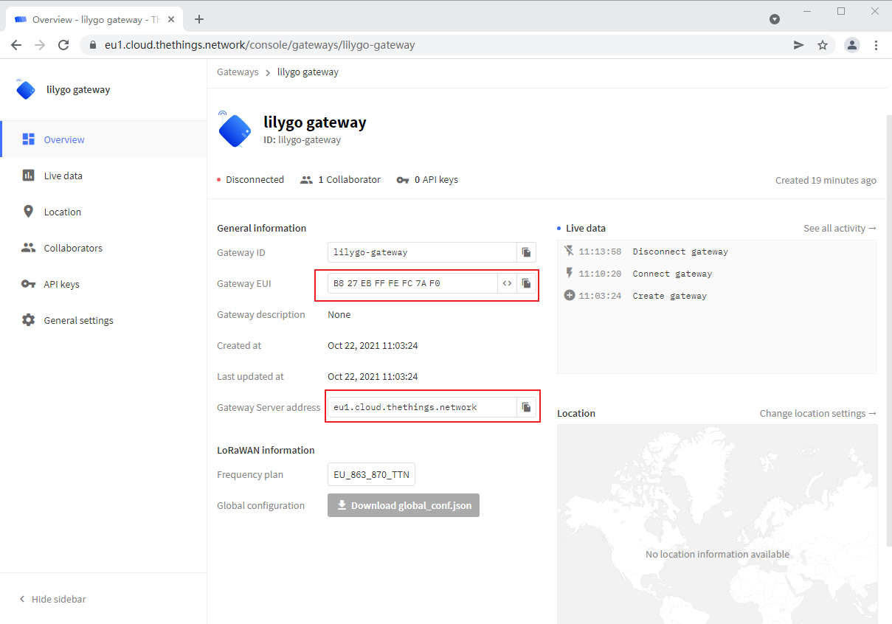

# LilyGo LoRa Series Quick Start On The Things Network

**[English](../en/LilyGo_LoRa_Series_Quick_Start_On_TTN.md) | 中文**

## 目录

- [测试环境](#测试环境)
- [在TTN上创建网关](#在ttn上创建网关)
- [在树莓派上运行sx1302_hal](#在树莓派上运行sx1302_hal)
  - [使能树莓派的SPI接口](#使能树莓派的spi接口)
  - [下载sx1302_hal源码并编译](#下载sx1302_hal源码并编译)
  - [修改配置文件](#修改配置文件)
  - [运行sx1302_hal](#运行sx1302_hal)
  - [检查网关连接状态](#检查网关连接状态)
- [在TTN上创建终端设备模型](#在ttn上创建终端设备模型)
  - [进入创建APP页面](#进入创建app页面)
  - [创建终端设备模型](#创建终端设备模型)
- [LoRaWAN终端设备](#lorawan终端设备)
  - [固件编译](#固件编译)
  - [固件下载](#固件下载)
  - [调试信息输出](#调试信息输出)
- [Q&A](#qa)
  - [构建`T-Motion S76G`固件出现LMIC报错](#构建t-motion-s76g固件出现lmic报错)
- [版本历史](#版本历史)

## 测试环境

> LoRaWAN End Device: T-Motion S76G
>
> LoRaWAN Gateway: Raspberrypi Model 3B + T-SX1302
>
> TTN Version: v3.15.1

## 在TTN上创建网关

1. 登录到 https://console.cloud.thethings.network/

2. 根据网关支持频段选择对应的集群


`T-SX1302`对应的频段为 `868MHZ`, 这里需要选择 `Europe1` 集群

> ! Warning
>
> 其中 `Legacy V2 Console`为TTN V2版本的服务器, 它将在2021年12月份关闭, 不建议使用

3. 创建一个网关


4. 配置网关信息

其中需要填入一个唯一的`Gateway EUI`, 如果没有更好的选择，可以使用树莓派的MAC地址


5. 选择频率


## 在树莓派上运行sx1302_hal

> NOTE
>
> 已有其他的也接入到TTN的LoRaWAN网关, 可以忽略该小节

### 使能树莓派的SPI接口


### 下载sx1302_hal源码并编译

1. 下载源码:

```shell
cd ~
git clone https://github.com/Lora-net/sx1302_hal.git
cd sx1302_hal
git checkout V2.1.0
```

2. 修改源码

因为 `sx1302_hal` 无法读取到 `T-SX1302` 的温度, 需要将 `libloragw/src/loragw_hal.c` 中的部分代码注释:

```diff
diff --git a/libloragw/src/loragw_hal.c b/libloragw/src/loragw_hal.c
index ffc8ec0..504bb42 100644
--- a/libloragw/src/loragw_hal.c
+++ b/libloragw/src/loragw_hal.c
@@ -1093,6 +1093,7 @@ int lgw_start(void) {
     dbg_init_random();

     if (CONTEXT_COM_TYPE == LGW_COM_SPI) {
+#if 0
         /* Find the temperature sensor on the known supported ports */
         for (i = 0; i < (int)(sizeof I2C_PORT_TEMP_SENSOR); i++) {
             ts_addr = I2C_PORT_TEMP_SENSOR[i];
@@ -1116,7 +1117,7 @@ int lgw_start(void) {
             printf("ERROR: no temperature sensor found.\n");
             return LGW_HAL_ERROR;
         }
-
+#endif
         /* Configure ADC AD338R for full duplex (CN490 reference design) */
         if (CONTEXT_BOARD.full_duplex == true) {
             err = i2c_linuxdev_open(I2C_DEVICE, I2C_PORT_DAC_AD5338R, &ad_fd);
@@ -1285,14 +1286,14 @@ int lgw_receive(uint8_t max_pkt, struct lgw_pkt_rx_s *pkt_data) {
         nb_pkt_left = nb_pkt_fetched - max_pkt;
         printf("WARNING: not enough space allocated, fetched %d packet(s), %d will be left in RX buffer\n", nb_pkt_fetched, nb_pkt_left);
     }
-
+#if 0
     /* Apply RSSI temperature compensation */
     res = lgw_get_temperature(&current_temperature);
     if (res != LGW_I2C_SUCCESS) {
         printf("ERROR: failed to get current temperature\n");
         return LGW_HAL_ERROR;
     }
-
+#endif
     /* Iterate on the RX buffer to get parsed packets */
     for (nb_pkt_found = 0; nb_pkt_found < ((nb_pkt_fetched <= max_pkt) ? nb_pkt_fetched : max_pkt); nb_pkt_found++) {
         /* Get packet and move to next one */
```

将 `T-SX1302` 的复位引脚修改为 `GPIO7`:

```diff
diff --git a/tools/reset_lgw.sh b/tools/reset_lgw.sh
index b58f0e9..56ff943 100755
--- a/tools/reset_lgw.sh
+++ b/tools/reset_lgw.sh
@@ -12,7 +12,7 @@
 # GPIO mapping has to be adapted with HW
 #

-SX1302_RESET_PIN=23     # SX1302 reset
+SX1302_RESET_PIN=7      # SX1302 reset
 SX1302_POWER_EN_PIN=18  # SX1302 power enable
 SX1261_RESET_PIN=22     # SX1261 reset (LBT / Spectral Scan)
 AD5338R_RESET_PIN=13    # AD5338R reset (full-duplex CN490 reference design)
@@ -90,4 +90,4 @@ case "$1" in
     ;;
 esac
```

3. 编译

```shell
make clean all
make install
make install_conf
```

### 修改配置文件

```shell
cd ~/sx1302_hal/bin
touch global_conf.json.sx1250.T-SX1302
```

添加以下内容到 `global_conf.json.sx1250.T-SX1302`:

```json
{
    "SX130x_conf": {
        "com_type": "SPI",
        "com_path": "/dev/spidev0.0",
        "lorawan_public": true,
        "clksrc": 0,
        "antenna_gain": 0, /* antenna gain, in dBi */
        "full_duplex": false,
        "precision_timestamp": {
            "enable": false,
            "max_ts_metrics": 255,
            "nb_symbols": 1
        },
        "radio_0": {
            "enable": true,
            "type": "SX1250",
            "freq": 867500000,
            "rssi_offset": -215.4,
            "rssi_tcomp": {
                "coeff_a": 0,
                "coeff_b": 0,
                "coeff_c": 20.41,
                "coeff_d": 2162.56,
                "coeff_e": 0
            },
            "tx_enable": true,
            "tx_freq_min": 863000000,
            "tx_freq_max": 870000000,
            "tx_gain_lut": [
                {
                    "rf_power": 12,
                    "pa_gain": 0,
                    "pwr_idx": 15
                },
                {
                    "rf_power": 13,
                    "pa_gain": 0,
                    "pwr_idx": 16
                },
                {
                    "rf_power": 14,
                    "pa_gain": 0,
                    "pwr_idx": 17
                },
                {
                    "rf_power": 15,
                    "pa_gain": 0,
                    "pwr_idx": 19
                },
                {
                    "rf_power": 16,
                    "pa_gain": 0,
                    "pwr_idx": 20
                },
                {
                    "rf_power": 17,
                    "pa_gain": 0,
                    "pwr_idx": 22
                },
                {
                    "rf_power": 18,
                    "pa_gain": 1,
                    "pwr_idx": 1
                },
                {
                    "rf_power": 19,
                    "pa_gain": 1,
                    "pwr_idx": 2
                },
                {
                    "rf_power": 20,
                    "pa_gain": 1,
                    "pwr_idx": 3
                },
                {
                    "rf_power": 21,
                    "pa_gain": 1,
                    "pwr_idx": 4
                },
                {
                    "rf_power": 22,
                    "pa_gain": 1,
                    "pwr_idx": 5
                },
                {
                    "rf_power": 23,
                    "pa_gain": 1,
                    "pwr_idx": 6
                },
                {
                    "rf_power": 24,
                    "pa_gain": 1,
                    "pwr_idx": 7
                },
                {
                    "rf_power": 25,
                    "pa_gain": 1,
                    "pwr_idx": 9
                },
                {
                    "rf_power": 26,
                    "pa_gain": 1,
                    "pwr_idx": 11
                },
                {
                    "rf_power": 27,
                    "pa_gain": 1,
                    "pwr_idx": 14
                }
            ]
        },
        "radio_1": {
            "enable": true,
            "type": "SX1250",
            "freq": 868500000,
            "rssi_offset": -215.4,
            "rssi_tcomp": {
                "coeff_a": 0,
                "coeff_b": 0,
                "coeff_c": 20.41,
                "coeff_d": 2162.56,
                "coeff_e": 0
            },
            "tx_enable": true
        },
        "chan_multiSF_0": {
            "enable": true,
            "radio": 1,
            "if": -400000
        },
        "chan_multiSF_1": {
            "enable": true,
            "radio": 1,
            "if": -200000
        },
        "chan_multiSF_2": {
            "enable": true,
            "radio": 1,
            "if": 0
        },
        "chan_multiSF_3": {
            "enable": true,
            "radio": 0,
            "if": -400000
        },
        "chan_multiSF_4": {
            "enable": true,
            "radio": 0,
            "if": -200000
        },
        "chan_multiSF_5": {
            "enable": true,
            "radio": 0,
            "if": 0
        },
        "chan_multiSF_6": {
            "enable": true,
            "radio": 0,
            "if": 200000
        },
        "chan_multiSF_7": {
            "enable": true,
            "radio": 0,
            "if": 400000
        },
        "chan_Lora_std": {
            "enable": true,
            "radio": 1,
            "if": -200000,
            "bandwidth": 250000,
            "spread_factor": 7,
            "implicit_hdr": false,
            "implicit_payload_length": 17,
            "implicit_crc_en": false,
            "implicit_coderate": 1
        },
        "chan_FSK": {
            "enable": true,
            "radio": 1,
            "if": 300000,
            "bandwidth": 125000,
            "datarate": 50000
        }
    },
    "gateway_conf": {
        "gateway_ID": "b827ebFFFEfc7af0",
        /* change with default server address/ports */
        "server_address": "eu1.cloud.thethings.network",
        "serv_port_up": 1700,
        "serv_port_down": 1700,
        /* adjust the following parameters for your network */
        "keepalive_interval": 10,
        "stat_interval": 30,
        "push_timeout_ms": 100,
        /* forward only valid packets */
        "forward_crc_valid": true,
        "forward_crc_error": false,
        "forward_crc_disabled": false,
        /* GPS configuration */
        //"gps_tty_path": "/dev/ttyS0",
        /* GPS reference coordinates */
        // "ref_latitude": 0.0,
        //"ref_longitude": 0.0,
        //"ref_altitude": 0,
        /* Beaconing parameters */
        "beacon_period": 0,
        "beacon_freq_hz": 869525000,
        "beacon_datarate": 9,
        "beacon_bw_hz": 125000,
        "beacon_power": 14,
        "beacon_infodesc": 0
    },
    "debug_conf": {
        "ref_payload": [
            {
                "id": "0xCAFE1234"
            },
            {
                "id": "0xCAFE2345"
            }
        ],
        "log_file": "loragw_hal.log"
    }
}
```

其中, `gateway_ID` 修改为 `Gateway EUI`

`server_address` 修改为 `eu1.cloud.thethings.network`

这些信息，要和 `TTN` 上创建的Gateway信息一致



> NOTE
>
> `TTN` 的 `serv_port_up` 和 `serv_port_down` 为 `1700`

### 运行sx1302_hal

```shell
cd ~/sx1302_hal/bin
./lora_pkt_fwd -c global_conf.json.sx1250.T-SX1302
```

### 检查网关连接状态

在TTN上检查网关是否连接成功


## 在TTN上创建终端设备模型

### 进入创建APP页面


### 创建终端设备模型

创建终端设备模型, 使用OTAA方式进行入网


>  NOTE
>
> `DevEUI`、`AppEUI`、`AppKey`选择自动生成即可

## LoRaWAN终端设备

### 固件编译

1. 下载示例代码

```shell
git clone https://github.com/Xinyuan-LilyGO/LilyGo-LoRa-Series.git
```

2. 创建Arduino工程

进入 `LilyGo-LoRa-Series\examples\TTN\TTN_OTTA` 目录, 将 `TTN_OTTA.cpp` 文件修改为 `TTN_OTTA.ino`

打开 `TTN_OTTA.ino`, 项目配置如下:


3. 修改板卡信息

并对 `utilities.h` 进行以下修改

```diff
diff --git a/examples/TTN/TTN_OTTA/utilities.h b/examples/TTN/TTN_OTTA/utilities.h
index 2874773..9b8aade 100644
--- a/examples/TTN/TTN_OTTA/utilities.h
+++ b/examples/TTN/TTN_OTTA/utilities.h
@@ -7,7 +7,7 @@
 // #define LILYGO_T3_V1_0
 // #define LILYGO_T3_V1_6
 // #define LILYGO_T3_V2_0
-// #define LILYGO_T_MOTION_S76G
+#define LILYGO_T_MOTION_S76G

 // #define LILYGO_T_MOTION_S78G         //Not support
 /*
@@ -171,12 +171,3 @@
 #else
 #error "Please select the version you purchased in utilities.h"
 #endif
```

4. 修改LoRaWAN入网信息

将在TTN上生成的 `DevEUI`、`AppEUI`、`AppKey` 安装对应的字节序填入 `loramac.cpp` 文件中


编译成功如下:


### 固件下载

1. 将`T-Motion S76G`插到PC的USB接口

2. 按住`BOOT`按键，然后按下`RESET`按键, 在 Arduino IDE 中点击 `upload`按钮

3. 烧录固件成功如下

   

4. 重新将`T-Motion S76G`插到PC的USB接口

### 调试信息输出

使用串口调试工具, 选择`DTR`勾选框, `T-Motion S76G` 插到PC的USB接口后迅速打开串口, 即可看到调试信息输出


在TTN上，能看到 `MAC payload` 字段的数据和 `loramac.cpp` 里面发送的数据是一致的


## Q&A

### 构建`T-Motion S76G`固件出现LMIC报错

出现以下问题, 是因为 LMIC 库版本不兼容的问题

```log
loramac.cpp:25:1: error: 'const lmic_pinmap' has no non-static data member named 'rx_level'
   25 | };
      | ^
exit status 1
'const lmic_pinmap' has no non-static data member named 'rx_level'
```

对 `loramac.cpp` 文件进行以下修改即可

```diff
diff --git a/examples/TTN/TTN_OTTA/loramac.cpp b/examples/TTN/TTN_OTTA/loramac.cpp
index 896be89..6b39f54 100644
--- a/examples/TTN/TTN_OTTA/loramac.cpp
+++ b/examples/TTN/TTN_OTTA/loramac.cpp
@@ -21,7 +21,7 @@ const lmic_pinmap lmic_pins = {
     .rxtx = RADIO_SWITCH_PIN,
     .rst =  RADIO_RST_PIN,
     .dio = {RADIO_DIO0_PIN, RADIO_DIO1_PIN, RADIO_DIO2_PIN},
-    .rx_level = HIGH
+    //.rx_level = HIGH
 };
 #else
 const lmic_pinmap lmic_pins = {
@@ -217,5 +217,3 @@ void loopLMIC(void)
 {
     os_runloop_once();
 }
```

## 版本历史

| 版本  | 主要改动 | 日期       | 作者    |
| ----- | -------- | ---------- | ------- |
| 1.0.0 | 初始版本 | 2021/10/22 | liangyy |
