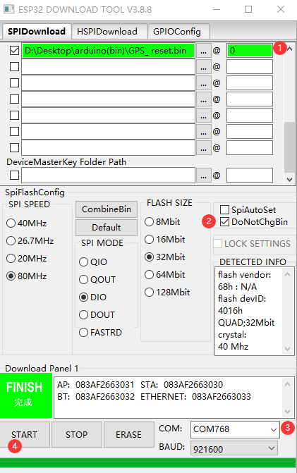

1. Tool download  [flash_download_tool](https://www.espressif.com/sites/default/files/tools/flash_download_tool_v3.8.5.zip)

2. "GPS_reset.bin" ，Reset GPS, open serial port print (make sure this reset GPS firmware is running properly)

3. Set according to the picture 

    

4. Burn "GPS_BsicNMEARead.bin"（Refer to the above burning) . Serial port monitor to view data

