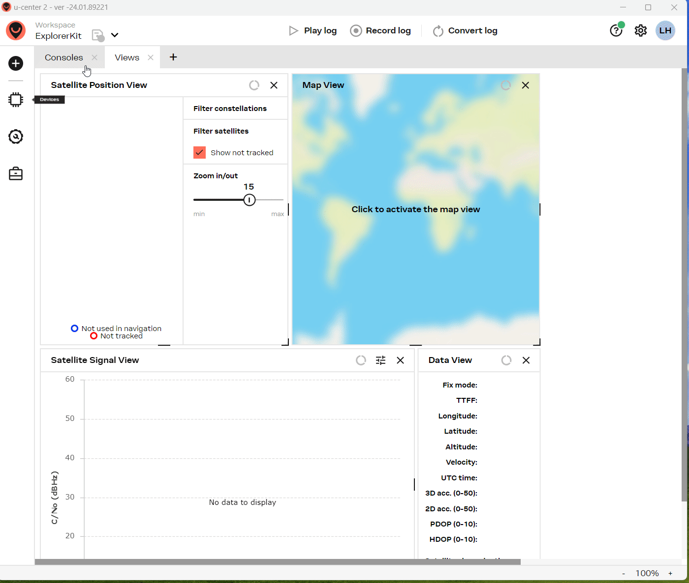

# GPS Reset firmware

- If the GPS is set to unknown parameters by mistake, causing the GPS to fail to operate normally, you can try to reset the GPS firmware.
- [T-Beam V1.x version record Video](https://youtu.be/Otu5d0fB6HU)
- [T-Beam Supreme GPS record Video](https://youtu.be/yYLgRMr5WDY)

   | name                      | firmware                                |
   | ------------------------- | --------------------------------------- |
   | TBEAM_V1X_NMEA_RESET.bin  | [firmware](./TBEAM_V1X_NMEA_RESET.bin)  |
   | TBEAM_V3.0_NMEA_RESET.bin | [firmware](./TBEAM_V3.0_NMEA_RESET.bin) |

- If the above two firmwares cannot make the GPS work properly, you can try the following two firmwares. Note that the two firmwares **TBEAM_V1X_NMEA_RESET** and **TBEAM_V3.0_NMEA_RESET** are used first to reset the GPS.

   | name                      | firmware                                |
   | ------------------------- | --------------------------------------- |
   | GPS_ reset.bin*           | [firmware](./GPS_%20reset.bin)          |
   | GPS_BasicNMEARead.bin*    | [firmware](./GPS_BasicNMEARead.bin)     |

   
## How to check GPS data ?

1. Download [u-center2](https://www.u-blox.com/en/product/u-center)
2. Check the GPS data according to the guide below
    

