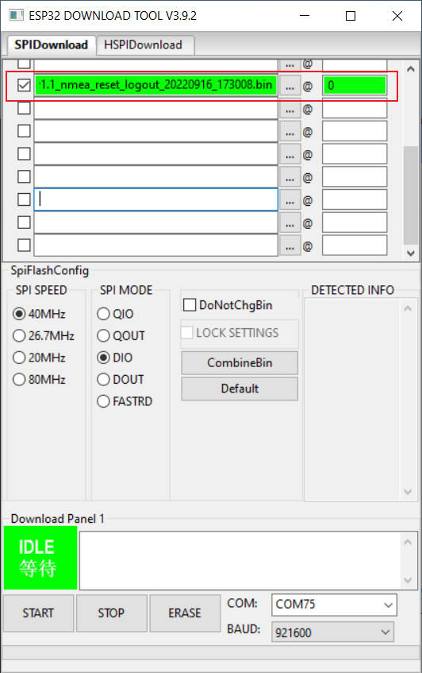

README:

Please use [Flash Download Tools](https://www.espressif.com.cn/sites/default/files/tools/flash_download_tool_3.9.3_0.zip), the configuration is consistent with the screenshot for burning.




After writing, open the serial monitor to check whether the GPS module is working normally. The following is an example of normal working:

```
rst:0x1 (POWERON_RESET),boot:0x13 (SPI_FAST_FLASH_BOOT)
configsip: 0, SPIWP:0xee
clk_drv:0x00,q_drv:0x00,d_drv:0x00,cs0_drv:0x00,hd_drv:0x00,wp_drv:0x00
mode:DIO, clock div:2
load:0x3fff0030,len:1184
load:0x40078000,len:12784
load:0x40080400,len:3032
entry 0x400805e4
Find AXP192/AXP2101 PMU!
Find SSD1306/SH1106 dispaly!
setupPower
Warning: Failed to find AXP2101 power management
AXP192 PMU init succeeded, using AXP192 PMU
=========================================
DC1  : +   Voltage: 3300 mV
DC2  : -   Voltage: 1800 mV
DC3  : +   Voltage: 3300 mV
LDO2 : +   Voltage: 3300 mV
LDO3 : +   Voltage: 3300 mV
=========================================
PowerKeyPressOffTime:4 Second
setupGPS
Get ack successed!
Get ack successed!


Module Info :
Soft version: .03 (45969)
Hard version: 0040007
Extensions:0

-----------debugNMEA-----------
�$GPRMC,,V,,,,,,,,,,N*53
$GPVTG,,,,,,,,,N*30
$GPGGA,,,,,,0,00,99.99,,,,,,*48
$GPGSA,A,1,,,,,,,,,,,,,99.99,99.99,99.99*30
$GPGSV,1,1,00*79
$GPGLL,,,,,,V,N*64
$GPTXT,01,01,02,ANTSTATUS=INIT*25
$GPRMC,,V,,,,,,,,,,N*53
$GPVTG,,,,,,,,,N*30
$GPGGA,,,,,,0,00,99.99,,,,,,*48
$GPGSA,A,1,,,,,,,,,,,,,99.99,99.99,99.99*30
$GPGSV,1,1,00*79
$GPGLL,,,,,,V,N*64
$GPTXT,01,01,02,ANTSTATUS=OK*3B

```