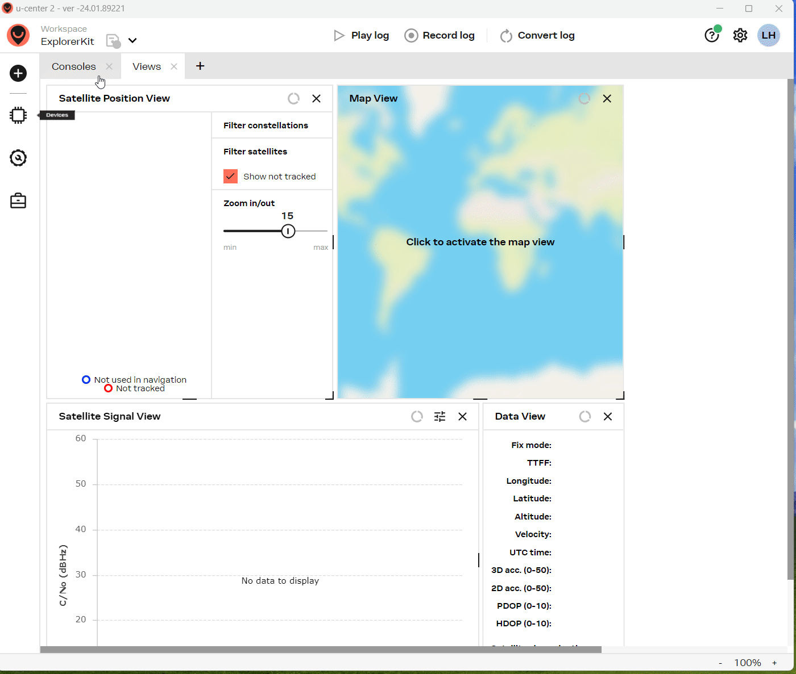
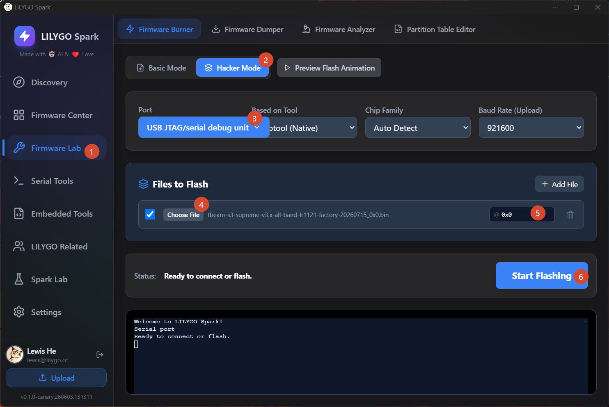

<div align="center" markdown="1">
  
</div>

<h1 align="center">LilyGo LoRa Factory Firmware</h1>

[中文版](README_CN.md)

## Directory Structure

```bash
firmware/
├── BLE Server
│   ├── esp32-ble-server-20241209_0x0.bin
│   └── esp32s3-ble-server-20241209_0x0.bin
│
├── T3 v1.3 (ESP32)
│   ├── lora-v1.3-868mhz-reciver-20260715_0x0.bin
│   ├── lora-v1.3-868mhz-sender-20260715_0x0.bin
│   ├── lora-v1.3-915mhz-reciver-20260715_0x0.bin
│   └── lora-v1.3-915mhz-sender-20260715_0x0.bin
│
├── T3 v1.6.1 (ESP32)
│   ├── lora-v1.6.1-433mhz-reciver-20260715_0x0.bin
│   ├── lora-v1.6.1-433mhz-sender-20260715_0x0.bin
│   ├── lora-v1.6.1-868mhz-paxcounter-20220919_0x0.bin
│   ├── lora-v1.6.1-868mhz-reciver-20260715_0x0.bin
│   ├── lora-v1.6.1-868mhz-sender-20260715_0x0.bin
│   ├── lora-v1.6.1-915mhz-reciver-20260715_0x0.bin
│   └── lora-v1.6.1-915mhz-sender-20260715_0x0.bin
│
├── T3 C6 (ESP32-C6)
│   ├── t3c6-v1.0-850mhz-reciver-20260715_0x0.bin
│   └── t3c6-v1.0-850mhz-sender-20260715_0x0.bin
│
├── T3 S3 (ESP32-S3)
│   ├── t3s3-v1.x-2400mhz-sx1280-factory-20241218_0x0.bin
│   ├── t3s3-v1.x-2400mhz-sx1280pa-factory-20241218_0x0.bin
│   ├── t3s3-v1.x-all-band-lr1121-factory_20250425_0x0.bin
│   ├── t3s3-v1.x-all-band-lr1121pa-20260715_0x0.bin
│   ├── t3s3-v1.x-all-band-sx1262-factory_20250425_0x0.bin
│   ├── t3s3-v1.x-all-band-sx1276-factory_20250425_0x0.bin
│   ├── t3s3-v1.x-all-band-sx1278-factory_20250425_0x0.bin
│   ├── t3s3-v1.x-all-band-sx1280-factory_20250425_0x0.bin
│   └── t3s3-v1.x-all-band-sx1280pa-factory_20250425_0x0.bin
│
├── T3 TCXO (ESP32)
│   ├── t3txco-v3.0-868mhz-reciver-20260715_0x0.bin
│   └── t3txco-v3.0-868mhz-sender-20260715_0x0.bin
│
├── T-Beam (ESP32)
│   ├── tbeam-v1.x-all-band-sx1262-factory-20260817_0x0.bin
│   ├── tbeam-v1.x-all-band-sx1276-factory-20260817_0x0.bin
│   ├── tbeam-v1.x-all-band-sx1278-factory-20260817_0x0.bin
│
├── T-Beam-1W (ESP32-S3)
│   ├── tbeam1w-v1.x-all-band-lr1121-factory-20260806_0x0.bin
│   ├── tbeam1w-v1.x-all-band-lr2021-factory-20260806_0x0.bin
│   └── tbeam1w-v1.x-all-band-sx1262-factory-20260715_0x0.bin
│
├── T-Beam-BPF (ESP32-S3)
│   └── tbeambpf-v1.x-144mhz-factory-20260715_0x0.bin
│
└── T-Beam-S3-Supreme (ESP32-S3)
    ├── tbeam-s3-supreme-v2.7.23-meshtastic-b246bcd-factory-20260506_0x0.bin
    ├── tbeam-s3-supreme-v3.x-all-band-lr1121-factory-20260715_0x0.bin
    └── tbeam-s3-supreme-v3.x-all-band-sx1262-factory-20260715_0x0.bin
```

## Firmware Naming Convention

Firmware filenames follow this naming convention:

```sh
[Product Model]-[Version]-[Frequency/Band]-[Chip Model]-[Function Type]-[Date]_[Flash Address].bin
```

### Naming Fields

| Field | Description | Example |
|-------|-------------|---------|
| **Product Model** | Device model identifier | `t3s3`, `tbeam`, `t3c6`, `t3txco` |
| **Version** | Hardware version number | `v1.x`, `v1.0`, `v3.0` |
| **Frequency/Band** | Working frequency or band | `868mhz`, `915mhz`, `all-band`, `144mhz` |
| **Chip Model** | LoRa chip model | `sx1262`, `sx1276`, `lr1121`, `lr2021` |
| **Function Type** | Firmware function | `factory`, `sender`, `reciver`, `meshtastic`, `paxcounter` |
| **Date** | Compilation date | `20260715` (YYYYMMDD format) |
| **Flash Address** | Flash memory start address | `0x0` |

### Common Function Types

- **factory**: Factory test firmware for hardware validation
- **sender**: LoRa transmitter firmware
- **reciver**: LoRa receiver firmware
- **meshtastic**: Meshtastic firmware
- **paxcounter**: People counter firmware

### Common Frequencies

- **868mhz**: European frequency band
- **915mhz**: American frequency band
- **433mhz**: Asian frequency band
- **all-band**: Multi-band support
- **2400mhz**: 2.4GHz frequency band

## BLE Firmware

### Bluetooth Function Test Firmware

- **esp32-ble-server-20241209_0x0.bin**: For ESP32, flash address 0x0
- **esp32s3-ble-server-20241209_0x0.bin**: For ESP32-S3, flash address 0x0

### Testing Method

1. Download and install [nRF Connect](https://www.nordicsemi.com/Products/Development-tools/nrf-connect-for-mobile) (Google Play)
2. Use nRF Connect to scan for Bluetooth devices
3. If you find a device named **LilyGo-BLE**, the Bluetooth function is working properly

## T-Beam Series Firmware function

- Perform functional tests by switching pages using buttons.
  * T-Beam ESP32 Version IO38 switching test function
  * T-Beam 1W ESP32S3 IO17(Previous page) BOOT Button(Next page)
  * T-Beam-Supreme BOOT switching test function

## T-Beam GNSS Diagnostics

1. Flash the T-Beam factory firmware.
2. Download and install [u-blox u-center 2](https://u-center2-updates.u-blox.com/u-center2-installer.exe).
3. Use the onboard button to switch the T-Beam board to the GNSS display mode.
4. Open u-center 2 and connect the device as shown in the demonstration image below:

5. The RX counter on the T-Beam screen should continuously increment (if it does not, there is a hardware issue).
6. Place the GPS antenna outdoors to monitor the number of satellites acquired and other detailed information.
7. Switch to the "Consoles" view to observe continuous NMEA message output; continuous output indicates that the GNSS chip is operational.
8. If a position fix cannot be obtained after a prolonged period, try replacing the GNSS antenna; the T-Beam requires an active GNSS antenna and cannot use a passive one.
9. If it still fails to work after replacing the antenna, measure the voltage between the GNSS antenna's center pin and GND; an operating voltage of approximately 3.0V indicates normal operation.
10. If all the above tests pass but a position fix still cannot be obtained, it can be concluded that the GNSS module has a fault.


## How to Flash Firmware?

### Preparation - Enter Download Mode

1. Connect the board via USB cable
2. Press and hold the **BOOT** button (If there is no BOOT button, connect **GND** and **IO0** with wires)
3. Press the **RST** button
4. Release the **RST** button
5. Release the **BOOT** button (If there is no BOOT button, disconnect IO0 from GND)
6. Upload firmware
7. Press the **RST** button to exit download mode

### Method 1: LILYGO Spark

1. Download [LILYGO Spark](https://lilygo.cc/pages/lilygo-spark)



### Method 2: Using ESP Download Tool

1. Download [Flash_download_tool](https://docs.espressif.com/projects/esp-test-tools/en/latest/esp32/production_stage/tools/flash_download_tool.html)

> **Note**: The following GIF demonstrates the flashing process for ESP32-S3. If you are using ESP32, select ESP32 instead of ESP32-S3.


**After flashing is complete, press the RST button to reset**

### Method 3: Using Web Flasher

- [ESP Web Flasher Online Tool](https://espressif.github.io/esptool-js/)


**After flashing is complete, press the RST button to reset**

### Method 4: Using Command Line

If the system prompts to install development tools, please install them first:

```bash
python3 -m pip install --upgrade pip
python3 -m pip install esptool
```

Start esptool.py:

```bash
python3 -m esptool
```

#### ESP32 Flashing Command

```bash
esptool --chip esp32 --baud 921600 --before default_reset --after hard_reset write_flash -z --flash_mode dio --flash_freq 80m 0x0 firmware.bin
```

#### ESP32-S3 Flashing Command

```bash
esptool --chip esp32s3 --baud 921600 --before default_reset --after hard_reset write_flash -z --flash_mode dio --flash_freq 80m 0x0 firmware.bin
```

## Related Resources

- [Espressif Official Documentation](https://docs.espressif.com/projects/esptool/)
