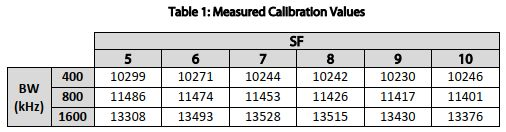

## Ranging Calibration

**Note:** The ranging feature of the SX128X is not supported if the module uses external RX and TX switching. 

To measure a distance the master device transmits a ranging request which a slave receives and then sends a response, if the request was for that particular slave. The master receives the slaves response and knows by use of a timer how long the master slave response exchange took. 

The total time for the master slave exchange includes a fixed processing time for the master and slave to transmit and receive the appropriate packets. This fixed time should be static and should be the same no matter how far apart the master initiator and slave receiver are. 

This fixed time then needs to be subtracted from the total round trip time. The remainder of the time is then proportional to the distance in a linear way.

Thus the ranging function needs a calibration value (the fixed time mentioned above) which changes according to the bandwidth and spreading factor used. Bandwidths of 400khz, 800khz and 1600khz are supported for ranging. The calibration value can also vary slightly between different modules or antennas used. So for the best results its suggested to calibrate a pair of modules together. The SX128XLT library does, by default, do a lookup from a pre-determined range of calibration values. 

Its been noticed in testing that variations in distance measurements of +\-10m are not unusual and this is typically the sort of adjustment that calibration might correct for. If your using the SX128x to measure long distances, into several kilometres, then the standard values provided by the library are probably accurate enough, a variation of 10m over 4km is hardly significant.  

There is a calibration method described in a Semtech document;

[Introduction to Ranging](https://semtech.my.salesforce.com/sfc/p/#E0000000JelG/a/44000000MDiH/OF02Lve2RzM6pUw9gNgSJXbDNaQJ_NtQ555rLzY3UvY)

My own approach to the ranging calibration has been simplified. The starting base for the calibration numbers was this table produced by Semtech;

After running some checks on my own set-ups, I came up with the following set of values, and the ranging programs pick up these numbers by default, you can of course use your own.

To check the the calibration values from the library a ranging slave was programmed with the **'55\_Ranging\_Slave'** program. Normally the ranging example programs automatically lookup the calibration value from a table in the file 'SX128XLT_Definitions.h'. However the value can be manually configured using the command;

setRangingCalibration(Calibration);

where Calibration is the value to use, normally in the range of 10,000 to 13,500. 

Lets follow and example of testing the calibration of the modules for ranging at spreading factor 8, bandwidth 800khz. From the initial table shown above, the calibration value is around 11350. Set the appropriate LoRa settings in the 'Settings.h' file for the slave and ranging calibration programs to;

	const uint8_t Bandwidth = LORA_BW_0800;          //LoRa bandwidth
	const uint8_t SpreadingFactor = LORA_SF8;        //LoRa spreading factor
	const uint8_t CodeRate = LORA_CR_4_5;            //LoRa coding rate

Program the slave device and at start-up the serial monitor should show;

	55_Ranging_Slave Starting
	Device found
	Calibration,11350
	RangingListen,

The example program **'56\_Ranging\_Calibration\_Checker'** varies the calibration value for each master ranging measurement starting at a value 1000 less than the calibration value provided and changing it in steps to a value that is 1000 more than the mid value. At each change of calibration value the distance is measured and sent to the serial monitor. When the distance goes to zero 3 times in a row the process stops. You can then see on the serial monitor which calibration value gives close to a 0m reading. 

When the ranging calibration program starts you should see this;

	56_Ranging_Calibration_Checker Starting
	Checking device
	Device found
	CalibrationStart,10350,CalibrationEnd,12350

After a while the program reported this;
	TransmitRanging,Calibration,11220,IRQ,200,Valid,RAW,47,Distance,3.2m,Time,33mS,OKCount,88,ErrorCount,0
	TransmitRanging,Calibration,11230,IRQ,200,Valid,RAW,1F,Distance,1.4m,Time,31mS,OKCount,89,ErrorCount,0
	TransmitRanging,Calibration,11240,IRQ,200,Valid,RAW,19,Distance,1.1m,Time,31mS,OKCount,90,ErrorCount,0
	TransmitRanging,Calibration,11250,IRQ,200,Valid,RAW,36,Distance,2.4m,Time,30mS,OKCount,91,ErrorCount,0
	TransmitRanging,Calibration,11260,IRQ,200,Valid,RAW,FFFFFF,Distance,0.0m,Time,31mS,OKCount,92,ErrorCount,0,  Distance is Zero!
	TransmitRanging,Calibration,11270,IRQ,200,Valid,RAW,2B,Distance,1.9m,Time,33mS,OKCount,93,ErrorCount,0
	TransmitRanging,Calibration,11280,IRQ,200,Valid,RAW,1D,Distance,1.3m,Time,30mS,OKCount,94,ErrorCount,0
	TransmitRanging,Calibration,11290,IRQ,200,Valid,RAW,0,Distance,0.0m,Time,31mS,OKCount,95,ErrorCount,0,  Distance is Zero!
	TransmitRanging,Calibration,11300,IRQ,200,Valid,RAW,FFFFD7,Distance,0.0m,Time,33mS,OKCount,96,ErrorCount,0,  Distance is Zero!

So with the slave using an initial calibration value of 11350 the master got to around 0m at a calibration value of 11300. Lets re-program the slave with a calibration value of 11300. To override the automatic lookup of the calibration value from the table in SX128XLT_Definitions.h ensure this command is enabled in setup() function after the main sequence functions calls configuring the SX128X device;

**LT.setRangingCalibration(11300);              //override automatic lookup of calibration value from library table**

The ranging calibration program then produced these results;

	TransmitRanging,Calibration,11300,IRQ,400,  RangingTimeout!  ,OKCount,94,ErrorCount,2
	TransmitRanging,Calibration,11310,IRQ,200,Valid,RAW,73,Distance,5.2m,Time,31mS,OKCount,95,ErrorCount,2
	TransmitRanging,Calibration,11320,IRQ,200,Valid,RAW,59,Distance,4.0m,Time,31mS,OKCount,96,ErrorCount,2
	TransmitRanging,Calibration,11330,IRQ,200,Valid,RAW,FFFF46,Distance,0.0m,Time,30mS,OKCount,97,ErrorCount,2,  Distance is Zero!
	TransmitRanging,Calibration,11340,IRQ,200,Valid,RAW,FFFFD0,Distance,0.0m,Time,33mS,OKCount,98,ErrorCount,2,  Distance is Zero!
	TransmitRanging,Calibration,11350,IRQ,200,Valid,RAW,FFFFCB,Distance,0.0m,Time,33mS,OKCount,99,ErrorCount,2,  Distance is Zero!

So a calibration value of maybe 11320 seems about right. This value can then be used to manually configure a particular set-up. 

The example program **54_Ranging_Master** can then be programmed with the same calibration value just determined. This program will carry out 5 ranging attempts and average the results to a distance shown on the serial monitor. This program will also drive a SSD1306 OLED for use as a portable distance measuring device. 

The master ranging programs calculates the distance and then adjusts the measured value with this setting in the Settings.h file;

**const float distance_adjustment = 1.0;        //adjustment to calculated distance** 

The adjustment value need to be determined by using the ranging programs to measure the distance over a long known path. I used a location when the master has line of sight over a long path, 4.405km in this case. This distance measurement was obtained from the 1:25000 Ordnance Survey map. 

Over this long path the average distance reported by the SX1280 4.424km, so the adjustment factor is 4.405/4.424 = 0.99571

### Variances at short distances. 

Regardless of the derived calibration value the conversion of the time of flight result from the values reported in the SX1280 registers to distance is a linear one, so any variation in register value over a fixed distance will represent a distance variation. Whilst you can average results the distance variations will be down to the limitations of the internal timing measurements that the SX128x takes. 

I set-up a outdoor test in a large open areas, my local playing field. The slave was placed on a pole about 1.8M off the ground and I stood with the master hand-held, away from my body, at 100m distance. The calibration and adjustment values were determined as mentioned above, so the master ought to be recoding a distance of 100m. The results of around 140 ranging measurements are below;

You can see a variation in distance of +\- 10m at 100m distance is not unusual. Apart from long term averaging its difficult to see what can be done to reduce these variances. 

It has also been noted that where there is a possibility of reflections such as in urban areas, larger variances than this have been seen particularly if the antenna orientations are moving or otherwise changed.

### Stuart Robinson
### March 2020